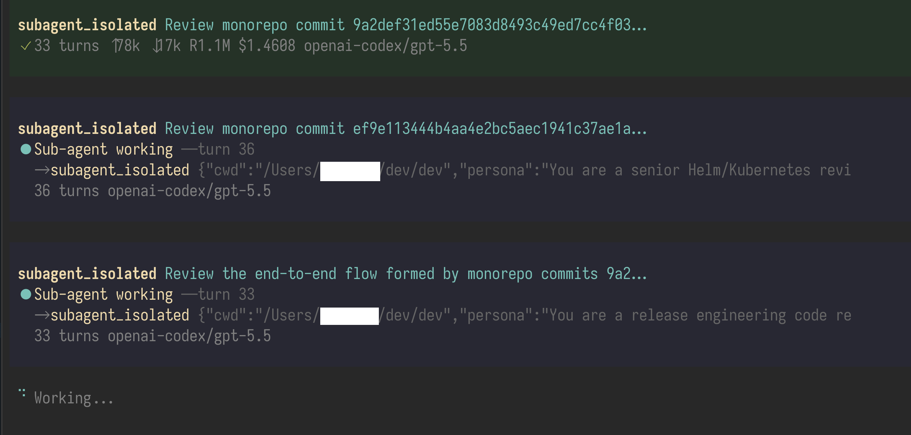

# pi-subagentura

A public [Pi](https://pi.dev) package that adds two in-process sub-agent tools:

- `subagent_with_context` — spawn a sub-agent that inherits the full conversation history
- `subagent_isolated` — spawn a sub-agent with a fresh, empty context window

The sub-agents run inside the current Pi process, stream live progress back to the UI, and inherit the active model by default.

## Why use it?

- Delegate focused side-tasks without leaving the current session
- Compare context-aware vs isolated reasoning
- Keep tool feedback lightweight with live status updates
- Avoid subprocess overhead for sub-agent execution



## Installation

Install globally:

```bash
pi install npm:pi-subagentura
```

Install for just the current project:

```bash
pi install -l npm:pi-subagentura
```

Try it for a single run without installing:

```bash
pi -e npm:pi-subagentura
```

You can also install directly from GitHub:

```bash
pi install git:github.com/lmn451/pi-subagentura
```

## Tools

### `subagent_with_context`

Starts a sub-agent with the current conversation history included in its prompt.

Parameters:

- `task` — required task for the sub-agent
- `persona` — optional system-style persona
- `model` — optional model override like `anthropic/claude-sonnet-4-5`
- `cwd` — optional working directory override

Best for:

- review tasks that depend on prior discussion
- continuing a line of reasoning in parallel
- focused implementation or research using the current context

### `subagent_isolated`

Starts a sub-agent with no inherited conversation history.

Parameters:

- `task` — required task for the sub-agent
- `persona` — optional system-style persona
- `model` — optional model override like `anthropic/claude-sonnet-4-5`
- `cwd` — optional working directory override

Best for:

- second opinions
- clean-room summaries
- avoiding context contamination from the parent session

## Example prompts

- “Use a sub-agent to review this change and list risks.”
- “Use an isolated sub-agent to propose a README outline for this repo.”
- “Spawn a context-aware sub-agent to continue debugging while we keep planning here.”

## Development

This repo uses Bun for local development.

```bash
bun install
bun test
bun run pack:check
```

## Release

Publishing is handled by GitHub Actions when you push a `v*` tag that matches `package.json`.

Example:

```bash
npm version patch
git push origin master --follow-tags
```

## Contributing

Contributions are welcome. See [CONTRIBUTING.md](./CONTRIBUTING.md).

## License

[MIT](./LICENSE)
