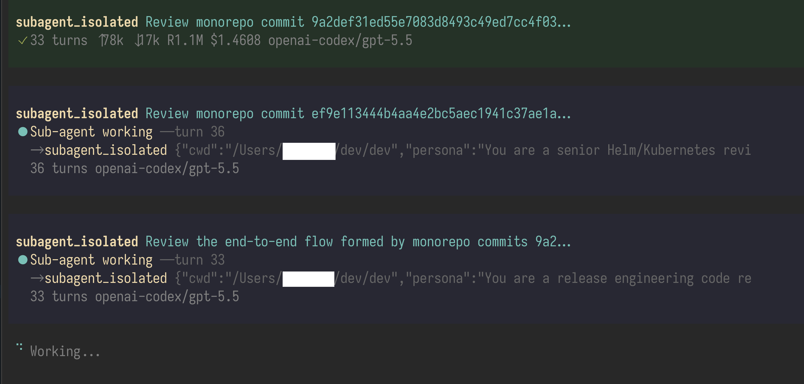

# pi-subagentura

[](https://npmjs.com/package/pi-subagentura) [](https://github.com/lmn451/pi-subagentura)

> **Docs ownership:** this repository is the source of truth for `docs/`.
> [`pi-docs`](https://github.com/lmn451/pi-docs) is the separately published doc
> injector that can index these files; it does not manage or sync them.

Give the parent Pi agent one task and let it build the team. pi-subagentura adds
reusable multi-agent workflows, lightweight background delegation, and real
child Pi sessions you can watch, attach to, and continue in tmux or Zellij.

Start Pi with the bundled orchestrator guidance and describe the outcome you
want. The parent can turn that request into a saved workflow, run its agents in
the background, and keep their intermediate results out of the parent context.

## Installation

See [CHANGELOG.md](./CHANGELOG.md) for breaking changes between major versions.

Install globally:

```bash
pi install npm:pi-subagentura
```

Install for just the current project:

```bash
pi install -l npm:pi-subagentura
```

Try it for a single run without installing:

```bash
pi -e npm:pi-subagentura
```

You can also install directly from GitHub:

```bash
pi install git:github.com/lmn451/pi-subagentura
```

## Quick start

```text
pi --orchestrator
/workflow review the authentication layer
/workflows
/workflow-tree
```

`/workflow` asks the parent to create, save, and immediately run a reusable
workflow. `/workflows` runs saved workflows, and `/workflow-tree` shows live
phases, agents, and cancellation controls.

## Reusable workflows

Workflow files are ordinary `.mjs` scripts with static metadata and a small set
of injected orchestration primitives:

- `agent()` runs an isolated role with optional schema validation, persona,
  model, thinking level, phase label, and process/in-process isolation.
- `parallel()` starts independent agent thunks concurrently and waits at a
  barrier before continuing.
- `pipeline()` streams each item through a sequence of stages without waiting
  for every item to finish a stage first.
- `phase()` names progress in the TUI. Saved workflows may call another saved
  workflow with `workflow(name, args)`, with one level of nesting.

Execution is async by default: the tool returns a workflow id while Pi remains
usable, with status and results available through the UI, slash commands, and
agent tools. Workflow agents default to separate Pi processes in tmux or
Zellij, so they are observable and attachable; when no multiplexer is
available, the runtime falls back to in-process execution. Intermediate agent
results stay in workflow variables outside the parent model context, and only
the workflow's final result returns to the parent.

The `workflow` tool also accepts bounded declarative `plan` objects with
ordered sequential phases and stable task IDs. Plans run in-process and use
the same async status, result, cancellation, and tree surfaces as script
workflows. With `durable: true`, the plan and committed task outcomes survive
same-host, same-real-cwd, same-Pi-session parent replacement. Recovery remains
manual in this preview: inspect the interrupted run, then use the fenced
`/workflow-resume` command. Process isolation, parallel phases, automatic
resume, durable JavaScript, and completion delivery are not supported yet.

### Automatic durable routing preview

Natural-request routing is opt-in and defaults to `off`:

```bash
pi --workflow-eager preferred
```

`preferred` routes only requests that show multiple independent work slices or
phased continuation. `always` routes other actionable requests too, but still
suppresses questions, social conversation, one-command operations, plan-only
requests, workflow-management commands, child contexts, replies to a pending
parent question, and requests while another workflow is active.

On Pi hosts with input interception, an eligible request is handled before the
parent model can perform direct work. A bounded in-process planner gets at most
one correction, the resulting sequential plan is validated, and the durable
controller commits and starts it in the same input turn. Planner model usage is
additional workflow-routing usage. Invalid plans, unavailable storage, and
authority failures surface their exact cause and do not invoke the legacy
`/workflow <task>` path.

If a host cannot register input interception, the extension uses the
minimum-capability model-policy lane instead. It instructs the parent to make a
durable declarative `workflow` call, observes up to two such calls, and emits
`routing_unconfirmed` after settlement when no call was observed. This fallback
is never reported as host-enforced.

Use `/workflow-plan create <task>` to invoke the same host-owned planner and
controller path explicitly. Eager and command-created plans retain the durable
preview restrictions above: sequential phases, in-process tasks, manual
recovery, and no durable completion notification.

Workflow scripts are trusted agent-authored JavaScript. The VM improves
determinism but is not a security boundary, so never run untrusted JavaScript.
Non-durable background workflow jobs are scoped to the current parent session
and are cancelled by reload, resume, quit, or a new session. Attachable
interactive sub-agents use durable artifacts and can survive those boundaries.

See the [workflow guide](./docs/workflows.md) and
[bundled examples](./examples/workflows/README.md).

## Why use it?

- Watch a real child Pi session and its tool activity live in tmux or zellij
- Supervise a bounded recursive tree of interactive children and grandchildren
- Focus or capture a descendant pane locally, or attach from another terminal
- Inspect bounded lifecycle, recent-event, and output previews without leaving Pi
- Continue true follow-up turns without losing the child's model context
- Inspect durable per-turn outputs and lifecycle events after detach or restart
- Run lightweight sub-agents in-process or in the background
- Compare context-aware and isolated reasoning
- Poll, collect, or cancel background jobs on demand
- Build reusable review, research, migration, and conversion workflows
- Use bundled orchestration defaults for scout/plan, oracle checks, parallel review, and review loops

## User commands

These commands are intended for people at the Pi prompt.

| Command             | Purpose                                                           |
| ------------------- | ----------------------------------------------------------------- |
| `/workflow`         | Create, save, and run a reusable workflow from a task             |
| `/workflows`        | Select and run a saved workflow                                   |
| `/list-workflows`   | Alias for `/workflows`                                            |
| `/workflow-status`  | List workflow jobs and their live or terminal status              |
| `/workflow-tree`    | Open the specialized workflow progress tree                       |
| `/workflow-resume`  | Resume an interrupted durable plan with current authority fences  |
| `/workflow-plan`    | Create and start a host-owned durable plan from a task            |
| `/subagents`        | Supervise all async work (`Ctrl+Alt+A`)                           |
| `/delete-workflow`  | Delete a saved workflow by name or picker                         |
| `/cancel-all-flows` | Cancel active jobs, workflows, and running interactive sub-agents |

## Agent-facing tools

The extension registers 21 public tools for parent agents.

| Tool                                | Purpose                                                              |
| ----------------------------------- | -------------------------------------------------------------------- |
| `workflow`                          | Run a trusted script, saved workflow, or sequential declarative plan |
| `save_workflow`                     | Validate and save a reusable workflow                                |
| `list_workflows`                    | List saved workflows                                                 |
| `delete_workflow`                   | Delete a saved workflow                                              |
| `get_workflow_status`               | Inspect a background workflow                                        |
| `get_workflow_result`               | Wait for and return a workflow result                                |
| `cancel_workflow`                   | Cancel a background workflow                                         |
| `subagent_with_context`             | Delegate with the parent conversation                                |
| `subagent_isolated`                 | Delegate with a fresh context                                        |
| `get_subagent_status`               | Inspect an async in-process job                                      |
| `get_subagent_result`               | Retrieve current or final async job output                           |
| `cancel_subagent`                   | Cancel an async job                                                  |
| `prune_subagent_jobs`               | Remove completed and failed jobs                                     |
| `list_available_models`             | List configured model identifiers                                    |
| `subagent_interactive`              | Launch an attachable Pi session in tmux/Zellij                       |
| `get_interactive_subagent_status`   | Inspect attachable child sessions                                    |
| `cancel_interactive_subagent`       | Kill an attachable child pane                                        |
| `send_interactive_subagent_message` | Send a follow-up while preserving child context                      |
| `list_subagent_artifacts`           | List durable interactive-agent artifacts                             |
| `read_subagent_artifact`            | Read lifecycle events and output snapshots                           |
| `cleanup_subagent_artifacts`        | Remove expired artifact directories and stale registry entries       |

## How it compares with other Pi sub-agent extensions

There is no single best extension; the useful distinction is what kind of
control you want after delegation. This table compares the most widely used Pi
sub-agent extensions as of July 2026, based on their published documentation.

| Extension                                                                                | Strongest fit                                                        | Pros                                                                                                                                                                                                                                                                             | Cons / tradeoffs                                                                                                                                                                                                                                         |
| ---------------------------------------------------------------------------------------- | -------------------------------------------------------------------- | -------------------------------------------------------------------------------------------------------------------------------------------------------------------------------------------------------------------------------------------------------------------------------- | -------------------------------------------------------------------------------------------------------------------------------------------------------------------------------------------------------------------------------------------------------- |
| **pi-subagentura**                                                                       | Work you may want to watch, attach to, or continue interactively     | Combines lightweight in-process jobs with real child Pi sessions; recursive supervisor with focus, bounded capture, and subtree cancellation; tmux/Zellij attach; mid-session follow-ups; durable per-turn artifacts; parent restart/reload rehydration; bounded workflow runner | Interactive mode requires tmux or Zellij and starts another process; in-process jobs and workflows do not survive parent-session replacement; workflow JavaScript is trusted code, not a security sandbox; smaller community than the alternatives below |
| [`@adamjen/pi-interactive-subagents`](https://github.com/HazAT/pi-interactive-subagents) | Fully asynchronous, multiplexer-native agent workflows               | Dedicated panes in cmux, tmux, Zellij, or WezTerm; live status widget; interruption and session resume; custom agents; child-to-parent help requests; bundled `/plan` and `/iterate` workflows                                                                                   | Child-process/multiplexer-only design with no lightweight in-process path; its help-request flow exits and later resumes the child; no documented immutable per-turn output and durable delivery-receipt protocol comparable to pi-subagentura's         |
| [`pi-subagents`](https://github.com/nicobailon/pi-subagents)                             | Feature-rich orchestration and automated multi-step coding workflows | Large built-in agent/workflow set; foreground and background runs; chains, parallel groups, worktrees, lifecycle artifacts, fleet UI, watchdog review, supervisor messaging, and nested delegation                                                                               | Much larger configuration and tool surface; more concepts to learn; does not provide an attachable terminal session—the fleet view is an inspector inside Pi                                                                                             |
| [`@tintinweb/pi-subagents`](https://github.com/tintinweb/pi-subagents)                   | Claude Code-style sub-agents inside Pi                               | Polished live widget and FleetView; foreground/background execution; steering and resume; custom agent definitions; worktree isolation; scheduling; model/tool/extension controls                                                                                                | Broad feature/configuration surface; UI and control stay inside the parent Pi experience rather than exposing a normal attachable child terminal; persistent sessions/artifacts are optional rather than the default source of truth                     |
| [`@mjakl/pi-subagent`](https://github.com/mjakl/pi-subagent)                             | A small, predictable delegation primitive                            | Simple tool shape; fresh or parent-seeded context; parallel calls; named persistent sessions; depth/cycle guards; rich streaming TUI                                                                                                                                             | Fewer orchestration features; no background job manager or durable event protocol; no live attachable pane; a stale persistent-session lock can require manual cleanup after a killed process                                                            |

If you want multiplexer-native async agents with broader terminal support, try
`@adamjen/pi-interactive-subagents`. If you want the broadest orchestration
toolbox, start with `pi-subagents`. If you want a Claude Code-like UI, try
`@tintinweb/pi-subagents`. If you want the smallest conventional child-process
implementation, try `@mjakl/pi-subagent`. pi-subagentura is for the narrower
case where a delegated agent should remain a real session you can observe and
re-enter, while still offering cheap in-process delegation for short tasks.

### Adjacent coding-agent implementations

These are not Pi extensions, so the comparison is secondary. They are useful
reference points for the interaction model.

| Tool                                                                | Pros                                                                                                                                                                     | Cons / difference from pi-subagentura                                                                                                                                                                                  |
| ------------------------------------------------------------------- | ------------------------------------------------------------------------------------------------------------------------------------------------------------------------ | ---------------------------------------------------------------------------------------------------------------------------------------------------------------------------------------------------------------------- |
| [Claude Code subagents](https://code.claude.com/docs/en/sub-agents) | Mature built-in delegation; foreground/background execution; custom prompts, models, tools, permissions, and skills; context forking; automatic or explicit routing      | Subagents are normally task workers that return results to the parent; they cannot spawn subagents; direct multi-session collaboration is a separate agent-teams feature; no tmux/Zellij attach-and-rehydrate protocol |
| [Codex subagents](https://developers.openai.com/codex/)             | First-class agent threads in the app, CLI, and IDE; inspect, steer, interrupt, and switch threads; custom agent configurations; bounded nesting and concurrency controls | Part of the Codex product rather than a portable Pi extension; delegation can consume substantially more tokens; no artifact contract designed for attaching to a normal child terminal process                        |
| [OpenCode agents](https://opencode.ai/docs/agents/)                 | Simple primary/subagent model; automatic or explicit `@` invocation; custom prompts, models, tools, and permissions; built-in parent/child session navigation            | Navigation stays inside OpenCode's session UI; no separate attachable mux pane or pi-subagentura-compatible durable artifact/delivery protocol                                                                         |



## Bundled orchestration defaults

The package also ships parent-only orchestration guidance for common multi-agent workflows in `ORCHESTRATOR_SYSTEM_PROMPT.md`. Enable it with the extension's `--orchestrator` flag:

```bash
pi --orchestrator
```

The guidance gives the parent agent reasonable default behavior when the user asks for things like:

- “review this codebase” — inspect first, then run fresh-context reviewers with focused angles
- “review my changes” — use read-only reviewers, synthesize findings, and only edit when authorized
- “plan this work” — scout relevant files, then produce a concrete implementation plan
- “check my approach” — run a context-aware oracle to challenge assumptions and drift
- “implement and review” — use one writer, parallel reviewers, and capped fix/review rounds

The defaults prefer async `subagent_isolated` for fresh scouts/reviewers, `subagent_with_context` for oracle checks, injected completions instead of polling, and one writer at a time for implementation. For cheap fanout, they suggest validating model availability before using optional model overrides.

## Cancellation context snapshots (opt-in)

Cancellation snapshots are **disabled by default**. To enable bounded snapshots before parent-initiated cancellation, set:

```bash
SUBAGENT_CANCEL_SNAPSHOT=full pi
```

In-process sub-agents write a private atomic JSON snapshot of the canonical active branch plus bounded partial streaming state. Interactive/process sub-agents write a private manifest that points to their already-persisted Pi session JSONL and artifact files; the transcript is not duplicated. Cancellation results expose receipt paths and errors, never snapshot contents.

Optional configuration:

- `SUBAGENT_CANCEL_SNAPSHOT_DIR` — override the private snapshot root. The directory and files are created with `0700`/`0600` permissions.
- `SUBAGENT_CANCEL_SNAPSHOT_MAX_BYTES` — maximum raw in-process snapshot size. The default is `1048576` bytes (1 MiB); accepted values range from `4096` bytes to `16777216` bytes (16 MiB). Invalid values use the default. Oversized snapshots preserve as much context as fits and record explicit truncation/error metadata.

Snapshots use schema version 1, temp-file + rename writes, deterministic per-session/job paths, and idempotent receipts so overlapping cancellation and shutdown paths do not duplicate files. They may contain sensitive prompts, tool arguments, and model output; keep the snapshot directory private and do not commit it.

## Tools

### `subagent_with_context`

Starts a sub-agent with the current conversation history included in its prompt.

Parameters:

- `task` — required task for the sub-agent
- `persona` — optional system-style persona
- `model` — optional model override like `anthropic/claude-sonnet-4-5`
- `cwd` — optional working directory override
- `async` — run in background; returns a jobId immediately instead of blocking
- `notifyOnComplete` — `"inject"` (default for async) persists full output; `"notify"` persists a pointer only. Both modes show a user-facing completion notification.
- `triggerTurnOnComplete` — optional override; notify defaults false and inject defaults true
- `maxAge` — optional TTL in ms for completed job retention (async only)

Best for:

- review tasks that depend on prior discussion
- continuing a line of reasoning in parallel
- focused implementation or research using the current context
- background side-quests that report results later

### `subagent_isolated`

Starts a sub-agent with no inherited conversation history.

Parameters:

- `task` — required task for the sub-agent
- `persona` — optional system-style persona
- `model` — optional model override like `anthropic/claude-sonnet-4-5`
- `cwd` — optional working directory override
- `async` — run in background; returns a jobId immediately instead of blocking
- `notifyOnComplete` — `"inject"` (default for async) persists full output; `"notify"` persists a pointer only. Both modes show a user-facing completion notification.
- `triggerTurnOnComplete` — optional override; notify defaults false and inject defaults true
- `maxAge` — optional TTL in ms for completed job retention (async only)

Async spawn results state whether completion output will be injected into the
parent LLM and whether delivery will automatically start a new parent turn.

Best for:

- second opinions
- clean-room summaries
- avoiding context contamination from the parent session
- background analysis without polluting the main conversation

### Async Workflow Tools

When you spawn a sub-agent with `async: true`, it returns a **jobId** immediately and runs in the background. Async jobs inject their result into the parent conversation by default when they complete, so you usually do not need to poll. Use these tools only when the user asks for status/collection, when a job appears stuck, or when manual follow-up is needed:

Background jobs are scoped to the current parent session. This includes both
`async: true` sub-agent jobs and jobs started by the `workflow` tool. They are
cancelled on `/reload`, `/resume`, quit, and `/new`; their in-memory registries
are not rehydrated into the next parent context. Interactive sub-agents are
different: their mux panes and artifact-backed registry can survive reloads and
restarts as described in [Interactive Sub-agent Tools](#interactive-sub-agent-tools).

#### `get_subagent_status`

Poll an async subagent job by jobId. Returns a live preview of the subagent's current turn, active tool, and partial output.

Parameters:

- `jobId` — required job ID returned by the async spawn

#### `get_subagent_result`

Retrieve an async subagent job's current or final result and usage summary. A
running job returns immediately unless explicit bounded waiting is requested.

Parameters:

- `jobId` — required job ID returned by the async spawn
- `wait` — optional; set to `true` to wait for a running job
- `timeoutMs` — optional wait timeout from 1 to 300,000 ms; defaults to 30,000 ms

#### `cancel_subagent`

Abort a running async subagent job by jobId.

Parameters:

- `jobId` — required job ID returned by the async spawn

#### `prune_subagent_jobs`

Remove all completed and failed subagent jobs from the registry. Running and cancelled jobs are preserved.

### Interactive Sub-agent Tools

Observability and attachability are the primary design goals of interactive
sub-agents—not debugging afterthoughts. Each child is a separate Pi process in a
tmux or zellij pane: watch it live, focus it from the current mux, attach from
another terminal, or send follow-ups through the parent while preserving child
context. If the parent is outside a mux, the child starts in a detached session
and returns an attach command. The pane is the live view; durable artifacts are
the source of truth.

#### `subagent_interactive`

Starts a separate interactive `pi` process in a tmux/zellij pane and returns immediately with:

- sub-agent id
- pane id and mux backend (tmux or zellij)
- `attach` command (works from outside the mux session)
- `focus` command (works from inside the same mux session)
- child Pi session file path
- artifact directory (events.ndjson + output.md)
- the window/tab name (in background mode) so you can find it in your mux UI

Parameters:

- `task` — required initial task
- `name` — optional display name for the pane/session
- `persona` — optional system prompt appended to the child session
- `model` — optional model override
- `cwd` — optional working directory
- `includeContext` — include serialized parent conversation in the child prompt (default: `false`)
- `mux` — optional backend: `"auto"` (default), `"tmux"`, or `"zellij"`. Auto picks the currently attached mux (via ZELLIJ_SESSION_NAME / TMUX env vars) then falls back to whichever backend binary is available. Explicit choice forces that backend.
- `background` — spawn in a detached named window/tab (invisible) instead of a visible horizontal split. Default `true` — your mux layout is undisturbed and you can attach later with the returned `focus` command. Pass `background: false` for a side-by-side split you can watch in real time.
- `notifyOnComplete` — `"notify"` (default) persists only an artifact pointer; `"inject"` persists full output. Both modes show a user-facing completion notification.
- `triggerTurnOnComplete` — optional override. Defaults to `true` for both modes; `false` disables automatic parent-turn triggering.

The spawn result states whether completion output will be injected into the parent
LLM and whether delivery will automatically start a new parent turn.

The sub-agent's work is **always** written to the artifact dir as `events.ndjson` (lifecycle log) and `output.md` (clean prose the child writes). The pane is for live monitoring; the artifact is the source of truth. The artifact survives parent restarts — sub-agents that finish while you're away are picked up on the next poll.

The interactive sub-agent **registry state** survives parent reloads and restarts. When spawned,
a per-(cwd) state file is written to `<cwd>/.pi/subagentura-state.json`.

The state file and subagent panes are preserved across these actions:

| Action                                            | State file  | Panes      | Rehydrated next start?                   |
| ------------------------------------------------- | ----------- | ---------- | ---------------------------------------- |
| **Ctrl+D (quit) → restart with `--session`/`-r`** | Kept        | Preserved  | ✅ Same session, parentSessionId matches |
| **Ctrl+D → fresh `pi` (no session)**              | Kept        | Preserved  | ❌ Different session, no match           |
| **`/reload`**                                     | Kept        | Preserved  | ✅ Same session                          |
| **`/resume`** (switch to another session)         | Kept        | Preserved  | ✅ If parentSessionId matches            |
| **`/new`**                                        | **Deleted** | **Killed** | ❌ Clean slate                           |
| **`/fork`**                                       | **Deleted** | **Killed** | ❌ Clean slate                           |

> **Note:** `/new` deletes the state file. If you do `/new` and then `/resume`
> back to the session where subagents were spawned, they **will not reappear**
> — the state file was already deleted. Only `/reload` or a restart with the
> same session (`--session`/`-r`) preserves the registry.

On `/reload` and `/resume`, the `session_start` handler rehydrates
the in-memory registry, filtering by `parentSessionId` so only subagents
that were created in the current session are restored.
Protocol-v2 byte cursors, pending delivery intents, and receipts are restored so
reload does not unconditionally replay already-dispatched completions.

Implementation details for crash-safe ordering and delivery recovery are in the
[state-file invariants in the source repository](https://github.com/lmn451/pi-subagentura/blob/master/AGENTS.md#rehydrate-state-file-cwdpisubagentura-state-json).

#### Unified async supervisor and recursive children

Run `/subagents` or press `Ctrl+Alt+A` to open the portable async supervisor.
It combines standalone async in-process jobs, workflow jobs and their agent
records, and the persisted lineage of interactive children and grandchildren.
`/workflow-tree` remains available as a specialized workflow-only view.
The supervisor uses a subtle theme-colored dither texture to simulate a dimmed
backdrop behind its modal controls; terminal cells do not support true blur.

Standalone jobs are owner-scoped to the current parent session. Expanding a
workflow shows its recent agent attempts, phases, usage, and bounded omission
counts. Agent records are observational; cancelling the workflow signals its
in-flight agents. Interactive lineage can include descendants created from
different working directories. Interactive
children receive a minimal child runtime that can launch more interactive
children, but does not register in-process or workflow orchestration tools.
Recursion is bounded by default to depth 8 and 256 **live** lineage nodes; the
manifests of exited agents are pruned so a long-lived session's all-time spawn
total never exhausts the budget. The supervisor shows active, actionable work
only. Cancelled, completed, malformed, orphaned, cyclic, and stale entries remain
available through retained artifacts but are hidden from the overlay. A footer
line reports how many nodes were hidden and why, whether the view is truncated,
and whether lineage refresh is failing, so hiding is never silent. Subtree
cancellation walks the raw lineage manifests rather than the displayed tree, so a
descendant past the depth or node cap is still cancelled and reported.

The overlay supports these controls:

| Key                    | Action                                                                                            |
| ---------------------- | ------------------------------------------------------------------------------------------------- |
| `↑`/`↓`, `j`/`k`       | Select an async job, workflow, or interactive lineage node                                        |
| `Enter`/`→`            | Expand type-specific activity, usage, agent records, or bounded artifact details                  |
| `x`                    | Cancel the selected running item; workflow and in-process cancellation propagates to owned agents |
| `v`                    | For interactive agents, capture a bounded terminal snapshot through tmux/Zellij                   |
| `n`                    | For interactive agents, open the optional native tmux popup or Zellij floating viewer             |
| `f`                    | For interactive agents, focus the persisted pane/window; warns when no client is attached         |
| `a`                    | For interactive agents, show the attach command                                                   |
| `X`                    | For interactive agents, confirm and cancel an actionable subtree deepest-first                    |
| `r`                    | Refresh registries, lineage, and pane liveness                                                    |
| `q`/`Esc`/`Ctrl+Alt+A` | Close the overlay without stopping agents                                                         |

Interactive row prefixes identify whether the item came from the live `[registry]`
or persisted `[lineage]`. Expanding a row shows its owner, root and parent IDs, cwd,
artifact directory, and Pi session file. A cancelled row disappears immediately.

Before pressing `f`, expand the selected interactive row to see its native return
hint. With default keymaps, tmux uses prefix + `;` for a split pane or prefix +
`l` for a detached window. Zellij uses `Ctrl+p`, then `p` for a split pane or
`Ctrl+t`, then `Tab` for a named tab. Customized multiplexer keymaps may differ.

Terminal capture is bounded by both bytes and lines. Expanded interactive
artifact details read only regular files and bound lifecycle-event reads to 8
KiB, output reads to 4 KiB, and displayed previews to 512 characters. Direct
interactive children remain in the root registry, while descendant completion
delivery remains owned by the Pi session that spawned that descendant.
Cancelling a descendant therefore does not inject its completion into the root
session, and cancellation preserves its artifact directory for later inspection.

#### Sub-agent completion protocol

Every interactive child runs protocol-only Pi lifecycle hooks and therefore
requires Pi SDK `>=0.80.6`. `before_agent_start` creates a provisional
turn, the first `turn_start` binds it to the persisted Pi user-entry id, tool
hooks record activity, and `agent_settled` records the authoritative completion
after retries, compaction, and queued continuations. When Pi accepts Enter while
streaming, it treats the message as steering inside the current agent run and
does not emit another `before_agent_start`. The child protocol therefore detects
the newly persisted steering user entry before its provider request and starts a
distinct artifact turn for it. The explicit CLI remains supported:

```bash
$ARTIFACT_DIR/cli.mjs done 0       # success — parent reads the literal output.md path baked into the child prompt
$ARTIFACT_DIR/cli.mjs error "msg"  # unrecoverable failure
# 'cancelled' is only set by the parent via cancel_interactive_subagent
```

The explicit completion command is mandatory for every initial and follow-up
turn. The child must complete these steps in order: write the final result to
`output.md`, run `cli.mjs done 0`, wait until exactly one completion event is
recorded successfully, then send its final assistant response. The command must
be the final tool call of the turn. If it fails to execute, the child must not
finalize; it fixes the failure and retries until completion is recorded. The
child lifecycle hook at `agent_settled` is a crash-safety fallback, not a
substitute for the explicit command. The system prompt, initial task footer,
and every injected follow-up prompt repeat this requirement so the command
remains the model's most recent instruction.

At each child turn start, mutable `output.md` is atomically reset without
touching earlier snapshots. Before each completion event, the current staging
file (including an empty file when the turn wrote nothing) is copied atomically to
`outputs/<eventId>.md` with byte count and SHA-256 metadata. Events are consumed
in physical NDJSON byte order; timestamps are display-only. Mixed v1/v2 logs and
legacy `output-N.md` snapshots remain readable. New legacy completions are
pointer-only because mutable `output.md` cannot be safely attributed to a turn.

Immutable snapshots are limited to 1 MiB. The parent and generated child CLI
check the staging file size before reading it. If `output.md` exceeds the limit,
the completion is still recorded with `outputError.code = "output_too_large"`
and its observed byte count, but no immutable snapshot is created or injected
into parent context. The oversized staging file remains available for manual
inspection in the artifact directory.

#### Completion notifications: notify vs inject

Completion delivery has two independent settings. `notifyOnComplete` controls
the payload saved for parent LLM context (full output versus artifact pointer);
`triggerTurnOnComplete` independently controls whether delivery starts a parent
LLM turn. Both payload modes display the same user-facing notification;
`notifyOnComplete` does not control toast behavior.

- `"inject"` persists one attributed custom completion message and triggers a turn by default for async in-process tools. Explicit `triggerTurnOnComplete: false` disables triggering.
- `"notify"` persists an attributed pointer-only custom message in parent context. The public `subagent_interactive` tool enables triggering by default; explicit `triggerTurnOnComplete: false` disables it.

| Configuration                             | Persisted in parent context | Starts an immediate parent turn |
| ----------------------------------------- | --------------------------- | ------------------------------- |
| `inject` (in-process default)             | Full completion output      | Yes (unless overridden)         |
| `inject` + `triggerTurnOnComplete: false` | Full completion output      | No                              |
| `notify` (interactive default)            | Artifact pointer only       | Yes                             |
| `notify` + `triggerTurnOnComplete: false` | Artifact pointer only       | No                              |

Triggering completions are handed to Pi's native `followUp` queue even while the
parent is busy, so they run after the active turn without relying on extension-owned
streaming state. Non-triggering completions wait until the parent is idle before
delivery into parent context, which prevents them from accidentally starting a
provider turn.

Therefore plain `notify` records the completion for both the UI and the parent
conversation, but the LLM does not react immediately. The pointer becomes
available to the model when the user starts the next parent turn. It is not a
visual-only notification and the completion is not discarded.

Both modes also show a user notification (`ui.notify`) after successful delivery. The notification
explicitly states whether completion output was injected into the parent LLM and
whether a new parent turn will start automatically. Async in-process and
interactive spawn results state the same behavior in future tense before work
begins. Errors use an error notification, cancellations use a warning, and
successful completions use an informational notification.

In the TUI, a normal completion therefore produces two visually separate
elements (exact colors depend on the active theme):

1. A user-notification status line (`ui.notify`). This is UI-only and is never
   added to session or LLM context.
2. A custom-message block beginning with `[Sub-agent ...]`. This is the
   separately persisted LLM-facing delivery: full output in `inject` mode, or
   only status and artifact pointers in `notify` mode.

Parent-initiated cancellation is the exception: the cancel tool result already
acknowledges it to the LLM, so cancellation shows the UI notification without
adding a duplicate custom-message block.

LLM-facing completions wait while the parent streams and flush as one bounded
message after `agent_settled`. The durable FIFO is limited to 32 records / 256 KiB,
with 32 KiB output per record and 64 KiB per flush. Overflow keeps status and
artifact pointers rather than silently dropping completion. Delivery is
at-least-once: deterministic delivery IDs and session receipts prevent routine
reload replay, but a crash between synchronous dispatch and receipt persistence
can still duplicate one completion.

#### `get_interactive_subagent_status`

Lists tracked interactive sub-agents, attach/select commands, and session paths. It intentionally does **not** capture pane output to avoid consuming model context.

Parameters:

- `jobId` — optional interactive sub-agent id; omit it to list all tracked sessions

#### `cancel_interactive_subagent`

Kills the mux pane for an interactive sub-agent by id. Writes a `cancelled`
event and immutable output snapshot before killing the pane, so artifacts remain
self-describing. Because the cancel tool result already acknowledges the action
to the parent LLM, parent-initiated cancellation also shows a warning via
`ui.notify` and persists a delivery receipt without injecting a duplicate
cancellation completion. The receipt is written before the pane is killed, so a
later poll or restart cannot replay that cancellation into LLM context.
Child-originated or otherwise unacknowledged cancellations still use the normal
completion-delivery path.

Parameters:

- `jobId` — required interactive sub-agent id returned by `subagent_interactive`

#### `send_interactive_subagent_message`

Sends a follow-up prompt to a running or idle interactive sub-agent by id. The message is delivered into the child's existing REPL via the sub-agent's mux backend (tmux send-keys or zellij write-chars + write 13), so the child's model context is preserved — this is a true follow-up turn, not a fresh spawn. A message submitted while the child streams is processed through Pi's one-at-a-time steering queue; its persisted user entry receives a distinct artifact turn and immutable completion snapshot. The child will call `cli.mjs done 0` again when finished, which wakes the parent through the usual `notifyOnComplete` path.
Refuses to send if the sub-agent is not in the registry, is neither `running` nor `idle`, or if the mux itself rejects the send call (e.g. the pane was killed between the status check and send). All three failure modes return a structured `isError: true` result.

Parameters:

- `id` — required sub-agent id
- `message` — required follow-up prompt text

#### `list_subagent_artifacts`

Lists all known interactive sub-agents: id, name, status, artifact directory, and
last-update timestamp. Use this to discover sub-agents that finished while the
parent was away.

#### `read_subagent_artifact`

Reads a sub-agent's artifact by id. Returns the lifecycle event log (pass `since` to fetch only new events) and, by default, the sub-agent's `output.md` content (the latest turn's output). This is the canonical way to get the sub-agent's work product — the parent agent does not need to read the tmux pane or capture rendered TUI.

Protocol-v2 completions map each Pi-derived `turnId` to an immutable
`outputs/<eventId>.md` snapshot. Pass `turnId` to read that output; the response's
`details.outputHistory` lists the available `turnId`/`eventId` mappings. Legacy
`output-N.md` history remains available through numeric `turn` and
`details.availableTurns`.

Parameters:

- `id` — required sub-agent id
- `since` — optional unix-ms timestamp; only return events with `ts >= since`
- `includeOutput` — include the output (default `true`); historical selectors imply output
- `turn` — optional turn number; read `output-N.md` for that specific turn instead of the latest `output.md`
- `turnId` — optional protocol-v2 Pi turn id; read its immutable `outputs/<eventId>.md` snapshot

### `list_available_models`

List all available AI models with auth status. Use this to validate model identifiers before passing them to subagent tools — prevents silent fallback to the parent session model.

Parameters:

- `filter` — optional substring filter for provider or model name
- `authOnly` — if true (default), only return models with configured auth

## Example prompts

- “Use a sub-agent to review this change and list risks.”
- “Use an isolated sub-agent to propose a README outline for this repo.”
- “Spawn a context-aware sub-agent to continue debugging while we keep planning here.”
- “Run a sub-agent in the background to run the test suite, then notify me when done.”
- “Spawn two isolated async sub-agents to review this code from different angles, then collect both results.”
- “Start an interactive sub-agent in tmux for investigating the auth bug; give me the attach command.”
- “Open an interactive sub-agent in a visible zellij pane so I can watch its tool calls live.”
- “Attach to the existing interactive sub-agent and send it a follow-up without losing context.”

## Development

This repo uses npm for local development.

```bash
npm install
npm test
npm run pack:check
```

### Branch preview releases

Maintainers can create a non-npm preview release from any branch through the **Branch Preview Release** GitHub Action. It verifies the branch, moves a `branch-<sanitized-branch>` tag to that commit, creates/updates a prerelease, and uploads the `npm pack` tarball plus checksums for inspection.

Pi consumes the preview through the git tag:

```bash
pi install git:github.com/lmn451/pi-subagentura@branch-feat-example
pi -e git:github.com/lmn451/pi-subagentura@branch-feat-example
```

The attached release tarball is for manual download/auditing; Pi installs the package from the git ref.

### Debug logging

Set `SUBAGENT_DEBUG_LOG_DIR=/some/path` to write a JSONL trace of sub-agent lifecycle events to `debug-YYYY-MM-DD.jsonl` in that directory. Each line is a self-describing JSON object with `timestamp`, `level`, `event`, and event-specific fields.

The `tool_start` event records the `toolName` and full `args` of every tool the sub-agent invokes — useful for replaying or auditing what a sub-agent did. Other events cover session creation, turns, message updates, prompts, and job completion.

The feature is a no-op when the env var is unset.

```bash
SUBAGENT_DEBUG_LOG_DIR=./.pi-debug pi   # writes ./pi-debug/debug-2026-06-10.jsonl
```

## Contributing

Contributions are welcome. See [CONTRIBUTING.md](./CONTRIBUTING.md).

A pre-commit hook formats staged files (via `simple-git-hooks` + `lint-staged`). A pre-push hook runs `npm run format:check` across the repository.

Install or refresh the hooks with `npm run hooks:install`. To skip a hook once, set `SKIP_SIMPLE_GIT_HOOKS=1`. To reformat the repository:

`npm run format`.

## License

[MIT](./LICENSE)
