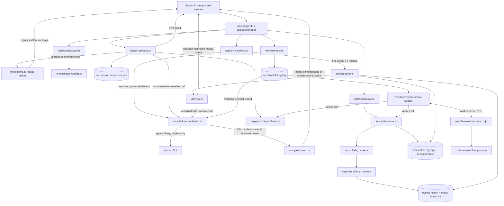
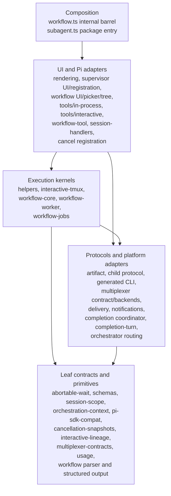
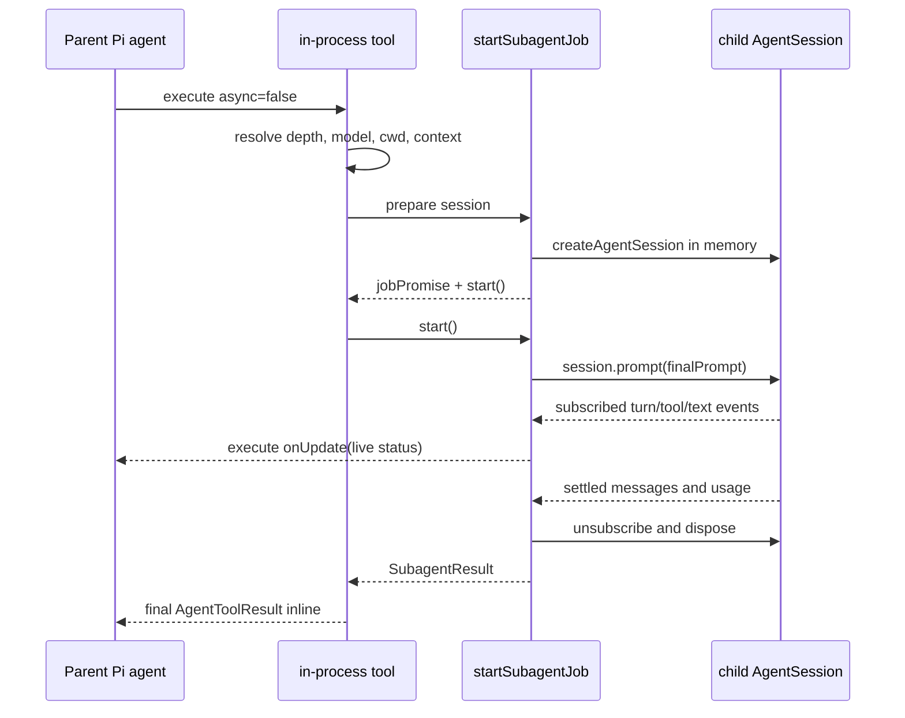
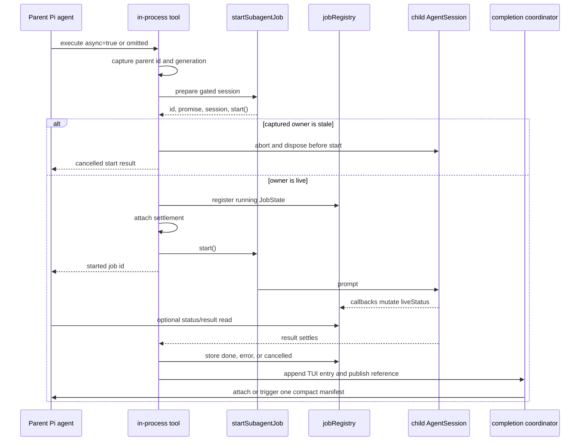
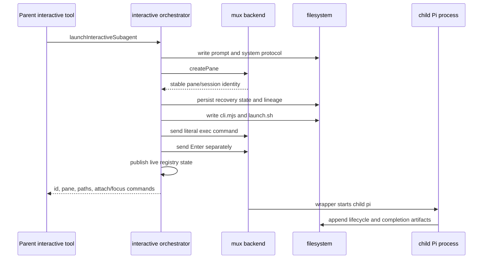
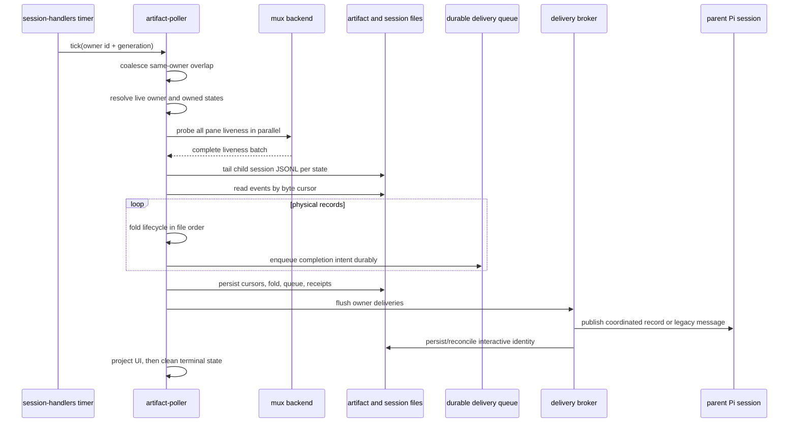
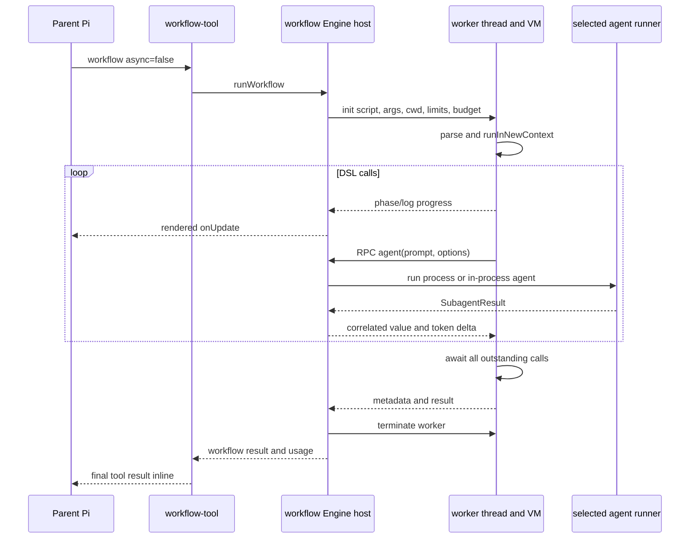
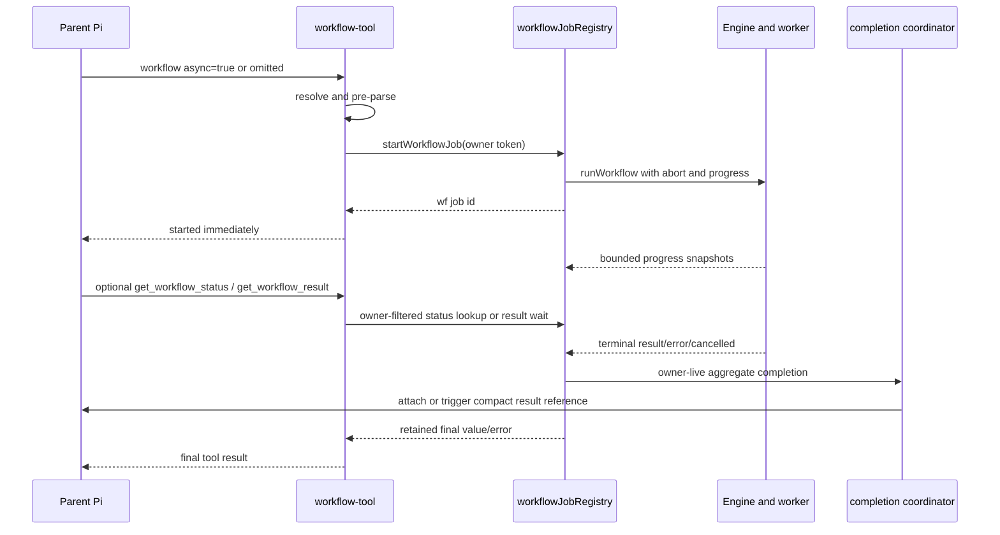

# pi-subagentura architecture

## 1. Purpose and scope

`pi-subagentura` is a Pi extension that runs delegated agents in three execution shapes:

1. an in-process Pi `AgentSession`;
2. an interactive `pi` process in a tmux, Zellij, or Herdr pane;
3. a workflow `Worker` plus `node:vm` program whose `agent()` calls use either the in-process or process-backed runner.

These shapes share UI and cancellation surfaces, but they do not share an execution protocol.
In particular, completion and result bytes reach humans and the parent model through distinct channels:

- a synchronous Pi tool return;
- a deterministic TUI-only completion entry excluded from LLM context;
- one compact coordinated manifest containing result references;
- explicit result or artifact retrieval;
- an upgrade-recovered legacy custom message from persisted pre-coordinator state.

The distinction is architectural, not cosmetic.
A tmux, Zellij, or Herdr screen is not an interactive result store.
A child session JSONL is not a completion receipt.
A successful `sendMessage` call is not yet durable acknowledgement.
A timestamp is not an artifact cursor.

This document describes the source under `src/`, the package/runtime companion boundaries, and the externally meaningful state contracts.
Source paths and key symbols are included so that each statement can be checked against the implementation.

---

## 2. System topology



### 2.1 The three execution shapes

| Shape                    | Execution location                         | Primary live state                                            | Completion authority                                                          | Default parent-model delivery                                                    |
| ------------------------ | ------------------------------------------ | ------------------------------------------------------------- | ----------------------------------------------------------------------------- | -------------------------------------------------------------------------------- |
| In-process, synchronous  | Pi extension process, child `AgentSession` | Child Pi session and execute callback                         | Returned `SubagentResult`                                                     | Direct final `AgentToolResult`                                                   |
| In-process, asynchronous | Pi extension process, child `AgentSession` | Per-session scope registry (with a legacy process-wide index) | Settled job promise and stored result                                         | Coordinated manifest references `get_subagent_result`                            |
| Interactive              | Separate `pi` process in tmux/Zellij/Herdr | Live interactive registry plus artifact files                 | Physical completion event in `events.ndjson`; immutable v2 snapshot for bytes | Coordinated manifest references the immutable snapshot and activity log          |
| Workflow, foreground     | Worker thread and VM in extension process  | `Engine`, worker RPC state, selected runner                   | Worker terminal result after outstanding agent calls settle                   | Direct final `workflow` tool result                                              |
| Workflow, background     | Same Worker/VM arrangement                 | Global `workflowJobRegistry`                                  | Settled workflow job promise                                                  | Coordinated manifest references `get_workflow_result`; owned children suppressed |

### 2.2 Mode comparison

| Property                      | In-process AgentSession                                                                  | Interactive Pi process                                                                        | Workflow Worker + VM                                                                             |
| ----------------------------- | ---------------------------------------------------------------------------------------- | --------------------------------------------------------------------------------------------- | ------------------------------------------------------------------------------------------------ |
| Process boundary              | None for the agent session                                                               | Child OS process                                                                              | Worker thread for script; runner may be in-process or child process                              |
| Durable across parent restart | No                                                                                       | Yes, through artifacts and `.pi/subagentura-state.json`                                       | No                                                                                               |
| Ongoing conversation          | No retained tool-facing conversation after completion                                    | Yes; a completed live pane becomes `idle` and accepts follow-up input                         | Workflow script is one run; nested saved workflows reuse the same worker                         |
| Progress source               | Pi `session.subscribe` callbacks                                                         | Artifact events and child session observation                                                 | Worker progress/RPC plus runner progress                                                         |
| Result polling                | Explicit status/result tool reads memory                                                 | Sole recurring artifact poller reads files                                                    | Explicit workflow status/result reads memory; process runner has a private awaited artifact loop |
| UI screen authority           | Not applicable                                                                           | No; mux capture is presentation only                                                          | Not applicable                                                                                   |
| Cancellation transport        | `AbortController`, `session.abort()`, descendant cascade                                 | Durable cancellation event/marker, then mux pane kill                                         | Abort job/engine, post worker abort, terminate worker, cancel active runner                      |
| Workflow schema enforcement   | When used by a workflow agent call with a schema: inject a native structured-output tool | When used by a workflow agent call with a schema: prompt for strict JSON, then parse/validate | Engine validates either runner result and retries                                                |
| Default async behavior        | Yes                                                                                      | Spawn returns immediately                                                                     | Yes                                                                                              |
| Security boundary             | Same process                                                                             | Process separation but not specified as a sandbox                                             | Worker and VM reduce accidental interference; VM is explicitly **not a security boundary**       |

### 2.3 Direct answers to the load-bearing questions

**Who polls?**

The only recurring scheduler is `src/session-handlers.ts:ensureInteractivePoller`.
After `session_start`, it creates one process-global, unref'ed five-second interval.
Every interval firing calls `pollArtifactChanges` once per live session scope with that owner's `{id, generation}` token.
`src/artifact-poller.ts` performs the owner-scoped tick and suppresses overlapping ticks for the same owner.
Neither child Pi, neither mux backend, nor an in-process `AgentSession` owns this timer.
Workflow process-backed calls have a separate bounded `awaitInteractiveResult` loop in `src/workflow-worker.ts`; that loop waits for one runner call and is not the recurring global scheduler.

**How do subagents communicate?**

- In-process child execution is direct Pi SDK use: `session.prompt`, `session.subscribe`, execute `onUpdate`, and shared memory.
- Interactive launch and follow-up prompts cross the child boundary as mux terminal input plus a separate Enter.
- Interactive lifecycle and result communication returns through filesystem artifacts, not through the mux screen.
- Child session JSONL is observed for activity and usage, not used as completion truth.
- Workflow scripts use structured worker-thread `postMessage` RPC to ask the host to run agents.
- Default asynchronous parent delivery makes each terminal record independently eligible and coalesces ready records into one hidden `subagent-manifest` at the next safe dispatch. TUI completion entries are a separate non-LLM channel. A related group is formed only when the caller supplies `completionPolicy="group"` and an explicit `completionGroupId`; same-turn launch and task text do not infer a group.

**Who owns each registry?**

- `src/helpers.ts` owns per-session in-process job maps and the legacy aggregate `jobRegistry` index.
- `src/interactive-tmux.ts` owns per-session interactive state maps and the legacy aggregate `interactiveSubagentRegistry` index.
- `src/artifact.ts` owns the schema and locking for durable `.pi/subagentura-state.json` recovery records.
- `src/workflow-jobs.ts` owns `workflowJobRegistry` for background workflows.
- `src/session-scope.ts` owns the live parent session-scope registry and generation fences.
- `src/orchestrator-routing.ts` owns parent-branch authority records, untrusted project-cache projection, and confirmation-bound routing metadata.
- `src/completion-coordinator.ts` owns per-session completion records, consumption receipts, `each`/named-group readiness, and compact manifest claims.
- `src/completion-turn.ts` owns lower-level idle Orchestratorv2 wake transport, process-global run-bound wake state, bounded retries, and recovery.
- `src/notifications.ts` owns only upgrade-recovery legacy in-process delivery queues and the aggregate queue.
- `src/session-handlers.ts` owns the one global poller handle and parent input/settlement integration.

**How does every mode reach parent context?**

- Synchronous in-process and foreground workflow calls return results inline.
- Asynchronous in-process completions publish a reference to `get_subagent_result`.
- Interactive artifact intents publish immutable snapshot and activity references.
- Background workflows publish a reference to `get_workflow_result`; their owned children never publish directly.
- `completionPolicy="each"` (default) makes records independently ready and coalescible. `completionPolicy="group"` requires a caller-declared `completionGroupId` and waits for a sealed all-terminal group.
- The coordinator attaches one ready manifest to pending human input or prepares one follow-up only after safe idleness. It passes that idle manifest to `sendCompletionTurn` with the actual parent streaming state; non-v2 falls through to native `sendMessage`, while idle Orchestratorv2 uses the synthetic user-wake transport.
- Full output is not automatic by default, and successful manual retrieval consumes the matching record. Related group membership is explicit: same-turn launch and task text do not infer relatedness.
- Deprecated `notifyOnComplete` / `triggerTurnOnComplete` inputs map to coordinated `each`; persisted pre-coordinator intents alone use the legacy broker.
- Parent session ownership and generation fencing prevent delivery across session replacement.

---

## 3. Activation and registration

`src/subagent.ts` is the composition root and supported runtime entry.
Registration is mode-gated so a child process does not recursively expose the full parent orchestration surface.

| Condition                           | Registration / behavior                                                                                                                                                             | Owner                                                                        |
| ----------------------------------- | ----------------------------------------------------------------------------------------------------------------------------------------------------------------------------------- | ---------------------------------------------------------------------------- |
| Every activation                    | Register legacy `subagent-notify` rendering; coordinated entry renderers register with session handlers                                                                             | `src/subagent.ts`, `registerCompletionCoordinator`                           |
| Every parent activation             | Register Pi session lifecycle callbacks                                                                                                                                             | `registerSessionHandlers`                                                    |
| Normal parent with `--orchestrator` | Append the bundled `ORCHESTRATOR_SYSTEM_PROMPT.md` during `before_agent_start`                                                                                                      | `src/subagent.ts:default`                                                    |
| Normal parent                       | Register in-process spawn, status, result, cancel, model, prune, and cleanup tools                                                                                                  | `registerInProcessSubagentTools`, `registerInProcessMaintenanceTools`        |
| Normal parent                       | Register interactive spawn/status/cancel/send/read/list tools                                                                                                                       | `registerInteractiveSubagentTools`                                           |
| Normal parent                       | Register workflow tools and commands                                                                                                                                                | `registerWorkflowTool` through internal `workflow.ts` barrel                 |
| Normal parent                       | Register cross-mode cancel command/shortcut                                                                                                                                         | `registerCancelAllFlows`                                                     |
| Normal parent                       | Register supervisor command/shortcut/UI routes                                                                                                                                      | `registerInteractiveSupervisor`                                              |
| `PI_SUBAGENTURA_CHILD=1`            | Register child artifact protocol and the restricted child-facing surface, then return                                                                                               | `registerChildProtocol` path in `src/subagent.ts`                            |
| `session_start`                     | Create/replace scope; clear stale wake; rehydrate matching state; seal recovered groups; recover delivered unacknowledged wakes; then ensure the global interval                    | `src/session-handlers.ts`, `completion-coordinator.ts`, `completion-turn.ts` |
| human `input`                       | Mark the coordinator's human-priority fence before the next turn                                                                                                                    | `src/session-handlers.ts`, `completion-coordinator.ts`                       |
| `before_agent_start`                | Mark the exact wake prompt, set the coordinator turn-start fence, and attach a ready manifest to the natural turn                                                                   | `src/session-handlers.ts`, `completion-coordinator.ts`, `completion-turn.ts` |
| `agent_start`                       | Mark this parent as streaming                                                                                                                                                       | `src/session-handlers.ts`                                                    |
| `agent_settled`                     | Settle the exact wake first; clear streaming; flush legacy paths; then settle coordinator readiness and dispatch remaining work                                                     | `src/session-handlers.ts`, `completion-coordinator.ts`, `completion-turn.ts` |
| `session_shutdown`                  | Clean owner state and retire scoped completions; clear coordinator and wake state; then fence generation, preserve or kill panes by reason, stop interval only after the last scope | `src/session-handlers.ts`, `completion-coordinator.ts`, `completion-turn.ts` |

The child launch wrapper exports both `PI_SUBAGENTURA_CHILD=1` and `ARTIFACT_DIR`.
The child protocol requires the artifact directory; the root mode gate prevents the launched child from recursively behaving like a normal parent extension.

### 3.1 Orchestratorv2 routing authority

`--orchestratorv2` appends `ORCHESTRATOR_V2_SYSTEM_PROMPT.md` and adds exactly
the routing-metadata tools `list_orchestrator_agents` and
`update_orchestrator_agent_description`. It does not select the parent model or
enforce a host-level tool allowlist; normal tools remain registered for legacy
compatibility, while the prompt directs this mode to interactive children.

`src/orchestrator-routing.ts` keeps two related representations:

1. the current parent session branch, whose latest valid
   `orchestratorv2-routing-authority` entry for each child is the sole trusted
   and actionable routing ledger; and
2. `.pi/subagentura-routing.json`, a bounded project-local cache/proposal.

Cache-only, stale, malformed, mismatched, unreadable, or over-capacity data is
non-actionable diagnostics. It never consumes routing capacity, gates
confirmation CAS, blocks an approved write, or erases valid parent authority.
When no valid authority exists, the view uses the closed-enum
`routing_metadata_untrusted` reason. Approved writes persist the bounded cache
first, then append the exact versioned parent authority entry; the cache is
rebuilt from current authority plus the incoming record.

Initial top-level spawn metadata uses `orchestratorv2` provenance. A
responsibility update requires a server-issued, single-use token bound to the
exact payload, current session generation, and a later user message; a
model-supplied confirmation is not sufficient. The parent-entry ledger is an
application-level boundary, not an OS security boundary: a same-UID process
that can tamper with the parent session file can forge authority entries.
Routing metadata is never a lifecycle registry or semantic resolver.

The interactive runtime launches before its initial routing metadata is
persisted. A persistence failure leaves the child live and returns a warning;
it does not cancel, roll back, replace, or respawn the child. Capacity failures
close the write without evicting metadata. Nested children remain owned by
their immediate child session and are not automatically top-level routes.

---

## 4. Dependency layers

The architecture uses dependency direction rather than a single monolithic service layer.
Type-only edges sometimes point upward to describe state without creating emitted JavaScript cycles.



Notable dependency facts:

- `multiplexer-contracts.ts` owns the dependency-light backend contracts and shared subprocess/capture helpers. `multiplexer.ts` selects and caches concrete backends; the backends import the contracts leaf, so this boundary has no runtime cycle.
- Edges from artifact or delivery types to upper interactive state are type-only where stated in source.
- `workflow-worker.ts` loads `workflow-worker-thread.mjs` by file URL, not by a normal TypeScript import.
- `subagent-artifact-cli.ts` supplies source text; it is materialized into each artifact directory rather than launched as the installed TypeScript module.
- Registration stays in adapters and the composition root; storage/protocol modules do not register Pi tools.

### Testing the boundaries

`usage.ts` has no runtime imports, so accounting tests can exercise normalization
and aggregation directly without loading Pi sessions or a multiplexer.
`workflow-core.ts` imports those utilities directly; its references to Pi-facing
result types are erased at runtime. Shared backend helpers live in
`multiplexer-contracts.ts`, which imports only Node's child-process API. The
concrete backends can therefore load independently of the registry; the module
boundary test in `tests/multiplexer.test.ts` verifies that separation.

Integration tests still exercise the boundaries that require coordination.
The parser in `workflow-worker.ts` still imports Pi-facing helpers, so importing
it also loads SDK dependencies.
`tests/workflow-usage.test.ts` uses real temporary session files and a mocked
interactive adapter to verify accounting, fixed snapshots, and cancellation
during reads. The Pi-session, lifecycle, and live multiplexer suites cover the
host SDK and process behavior. Extracting a module does not replace those tests.

Directory names organize navigation; imports and fixture ownership determine
test isolation. The current layout keeps runtime modules in `src/` and tests in
`tests/`. Tests should import the smallest relevant module and explicitly own
their sessions, artifacts, and terminal adapters. See the
[test-isolation guide](./docs/interactive-subagent-test-isolation.md) for the
current setup.

---

## 5. In-process AgentSession execution

### 5.1 Responsibilities

`src/tools/in-process.ts` is the Pi tool façade.
It registers `subagent_with_context`, `subagent_isolated`, `get_subagent_status`, `get_subagent_result`, `cancel_subagent`, `list_available_models`, `prune_subagent_jobs`, and artifact cleanup.

`src/helpers.ts:startSubagentJob` is the execution kernel.
It resolves Pi runtime compatibility, creates an in-memory `SessionManager` and `AgentSession`, subscribes to Pi events, builds the prompt, maintains cumulative live usage across assistant turns, aggregates final usage, and disposes the session.
A live sample combines completed turns with the current partial assistant message exactly once; the latest turn alone is never presented as the agent total.

`src/orchestration-context.ts` carries nested `jobId`, depth, and root-session identity through `AsyncLocalStorage`.
`src/session-scope.ts` supplies parent session scopes, ownership tokens, and generation fences.
`src/completion-coordinator.ts` owns readiness, grouping, consumption, and
compact manifest claims.
`src/completion-turn.ts` is the lower-level idle Orchestratorv2 transport and
recovery layer; it preserves native non-v2 delivery.
`src/notifications.ts` retains the upgrade-only legacy inject/pointer broker.

### 5.2 Context and model selection

`subagent_with_context` reads the current branch from `ctx.sessionManager.getBranch()`, converts message entries with Pi's `convertToLlm`, and serializes them.
The conversation is context-only material prepended to the delegated task.
It is a direct in-memory conversion; it does not tail the parent's session file.
An empty branch is rejected.

`subagent_isolated` supplies no branch context.
Both tools inherit orchestration lineage from `resolveSpawnDepth` and reject depth beyond `SUBAGENTURA_MAX_ORCHESTRATION_DEPTH`, default three.

`resolveModel` uses exact model lookup.
It tries the parent registry, including extension-added models, then the global provider/model registry, and falls back to the parent default when an override cannot be resolved.
`src/pi-sdk-compat.ts` isolates modern `ModelRuntime` versus legacy auth/model-registry APIs.
The returned details expose the session's effective thinking level, including Pi capability clamping.

### 5.3 Synchronous path



The synchronous job is not inserted into `jobRegistry`.
Its generated ID still scopes `AsyncLocalStorage`, so nested descendants can record their parent and participate in cancellation.
Progress uses Pi's execute `onUpdate` callback; final output is the tool return.
No asynchronous notification and no artifact poller participates.

### 5.4 Asynchronous path



Registration deliberately precedes `start()`.
The prepared prompt is gated, so a `session_shutdown` between preparation and publication can invalidate the generation token, dispose the session, and prevent model/tool side effects.

There is no autonomous in-process poller.
`get_subagent_status` and non-waiting `get_subagent_result` read the shared `JobState` directly.
A requested result wait races the existing promise against caller abort and a bounded timeout; cancelling the wait does not cancel the job.
Successful terminal retrieval appends a consumption receipt before returning and suppresses later automatic delivery.

`attachAsyncJobSettlement` prevents a cancelled record from being changed by late settlement. The coordinated default publishes one TUI-only terminal entry and one bounded job-result reference for each terminal record. Independent `completionPolicy="each"` records are eligible immediately and coalesce while the parent is busy. Explicit `completionPolicy="group"` with a caller-declared `completionGroupId` waits for parent settlement to seal membership and for every member—including errors and cancellations—to become terminal; same-turn launch or task text never infers a group. Deprecated legacy fields map to coordinated `each`; only persisted pre-coordinator state retains bounded inject/pointer recovery behavior.

### 5.5 Cancellation and retention

`cancel_subagent` snapshots the target, records cancellation metadata, and calls `abortJobTree`.
The target controller aborts the `AgentSession`; `cascadeChildAborts` walks recorded `parentJobId` descendants.
The kernel checks the signal after `prompt()` because Pi may resolve rather than reject a prompt on abort.

The authoritative in-process registry is per session scope; its legacy process-wide index survives module reload but not process restart.
Done/error entries persist when `maxAge` is omitted or `0`. A positive integer `maxAge` in the safe Node timer range (1–2,147,483,647 ms) schedules cleanup at settlement: ordinary terminal entries are removed when it elapses, while an uncollected coordinated result remains protected and is removed when collected after expiry (or when its TTL later elapses). Entries can also be pruned explicitly and may be evicted oldest-first at the 100-entry cap.
Cancelled entries are scheduled for immediate deletion.

---

## 6. Interactive Pi process execution

### 6.1 Responsibilities and topology

`src/tools/interactive.ts` registers:

- `subagent_interactive`;
- `get_interactive_subagent_status`;
- `cancel_interactive_subagent`;
- `send_interactive_subagent_message`;
- `read_subagent_artifact`;
- `list_subagent_artifacts`.

`src/interactive-tmux.ts` is historically named but backend-neutral.
It owns path and prompt construction, launch ordering, registry publication, status folding, follow-up input, cancellation, and mux routing.
`src/multiplexer.ts` defines the backend contract.
`src/multiplexer-tmux.ts` and `src/multiplexer-zellij.ts` own subprocess commands and pane identity.

### 6.2 Crash-safe launch ordering



The required crash ordering is:

1. create an addressable pane;
2. durably persist recovery identity before child launch;
3. persist lineage before exposure when lineage is enabled;
4. materialize the generated CLI and launch wrapper;
5. send the wrapper command and Enter;
6. publish the complete state to the live registry only after input succeeds.

If persistence fails, the pane is killed.
If command construction or mux input fails, persisted state and lineage are removed best-effort and the orphan pane is killed.
This prevents a running child with no recoverable identity and prevents registry exposure of a launch that was never dispatched.

The wrapper exports `ARTIFACT_DIR`, `PI_SUBAGENTURA_CHILD=1`, and lineage environment.
It runs `cli.mjs start`, installs an `EXIT` trap that runs `cli.mjs process-exit`, then executes:

```text
pi --session <child-session.jsonl> --name <name> [model/thinking flags]
   --append-system-prompt <system.md> @<prompt.md>
```

The mandatory child system protocol tells the agent to write `output.md`, invoke `cli.mjs done 0` as its final tool call, wait for success, and keep the REPL open.
`src/child-protocol.ts` supplies Pi callback-driven activity and an `agent_settled` completion fallback.

### 6.3 Mux boundary

The mux carries control and terminal input only:

- create pane/session/tab;
- send literal text and Enter;
- check liveness;
- best-effort kill;
- focus;
- bounded screen capture;
- optional native viewer;
- build attach commands.

A captured screen is supervisor UX, not lifecycle or output authority.
The backend recorded at spawn never changes.

In `auto` mode, backend resolution prefers an attached Herdr, Zellij, or tmux
environment; outside an attached mux it falls back to available tmux before
Zellij. Herdr requires Pi to run inside a Herdr-managed pane and persists the
exact socket path for later operations and rehydration.
Detached tmux children use a dedicated session and later windows.
Detached Zellij children use a background session/tab because detached splits do not materialize reliably.
All backends establish a stable identity and route every later operation through
it; Zellij normalizes its pane ID, tmux validates and preserves its canonical
pane ID, and Herdr retains its terminal/pane identity.

### 6.4 Child turns and follow-up

The child callbacks bind lifecycle activity to a Pi-derived `turnId`, preferably the latest persisted user session-entry ID.
Before that ID exists they use a provisional turn and rebind at later lifecycle boundaries.
At turn start, `output.md` is reset and `active-turn.json` is replaced atomically.

A successful completion while the pane remains alive folds to `idle`, not `exited`.
`send_interactive_subagent_message` accepts `running` or `idle`, bounds the input, appends the mandatory completion reminder, sends literal text, then Enter.
The REPL can queue mid-turn input.
A new persisted user entry establishes the next turn.

### 6.5 Interactive cancellation

Cancellation first preserves authority on disk, then tears down the process:

1. optionally create a bounded cancellation snapshot;
2. write `.cancelled` best-effort;
3. append a parent-source cancelled completion;
4. in legacy mode, acknowledge the synthetic delivery identity so it cannot be re-injected;
5. mark live state cancelled;
6. kill the recorded mux pane best-effort;
7. let the wrapper's `EXIT` trap append `process_exited`.

The filesystem action precedes pane kill so a crash between those operations still leaves cancellation truth.

---

## 7. Artifact layout and protocol v2

### 7.1 Layout

For an interactive child `<id>`:

```text
<session-root>/subagentura/<cwd-label-random>/
├── <timestamp>-<id>.jsonl              child Pi session log
└── artifacts/<id>/                     directory mode 0700
    ├── <label>-prompt.md                initial task, mode 0600
    ├── <label>-system.md                persona + mandatory protocol, 0600
    ├── <label>-launch.sh                generated wrapper, mode 0700
    ├── cli.mjs                          generated artifact CLI, mode 0700
    ├── active-turn.json                 current turn binding, atomic 0600
    ├── output.md                        mutable active-turn staging, atomic 0600
    ├── events.ndjson                    append-only lifecycle/activity, 0600
    ├── outputs/
    │   └── <eventId>.md                 immutable v2 snapshot, 0600
    ├── output-N.md                      legacy numeric snapshot
    ├── .cancelled                       parent cancellation marker
    └── .completion-<turn-hash>.lock/    transient exactly-once lock
```

Project recovery state is separate:

```text
<parent-cwd>/.pi/
├── subagentura-state.json
└── subagentura-state.lock             regular exclusive state-lock file
```

Lineage manifests live under the Pi session directory and are authority only for descendant discovery/cancellation topology.
They are not lifecycle or delivery authority.

### 7.2 v1 and v2 records

Legacy records have no `version` and use `started`, `tool_activity`, `done`, `error`, or `cancelled` with numeric `ts`.
The wrapper still emits legacy `started`, so a valid log can contain both protocol generations.
On read, legacy events receive stable synthetic identities derived from physical byte offset and raw bytes.

Every v2 record contains:

| Field        | Contract                                                                                                 |
| ------------ | -------------------------------------------------------------------------------------------------------- |
| `version`    | Exactly `2`                                                                                              |
| `eventId`    | Physical event identity; for a completion with captured output, also the immutable snapshot filename key |
| `turnId`     | Logical Pi turn identity                                                                                 |
| `ts`         | Informational time, never ordering authority                                                             |
| discriminant | `turn_started`, `tool_activity`, `completion`, or `process_exited`                                       |

V2 variants:

| Event            | Required semantics                                                                                                                                                 |
| ---------------- | ------------------------------------------------------------------------------------------------------------------------------------------------------------------ |
| `turn_started`   | Status `running`; establishes active turn                                                                                                                          |
| `tool_activity`  | Status `running`; phase `start` or `end`; bounded optional tool/summary/message                                                                                    |
| `completion`     | Outcome/status `done`, `error`, or `cancelled`; source `agent_settled`, `agent_end`, `explicit`, `process_exit`, or `parent`; optional immutable output descriptor |
| `process_exited` | Process terminal record with integer exit code; not itself a completion notification                                                                               |

### 7.3 Completion and immutable output contract

A logical v2 turn has at most one completion.
Both the in-package writer and generated `cli.mjs`:

1. acquire the same per-turn hash-named directory lock;
2. check whether that `turnId` already has a completion;
3. snapshot output first;
4. append the completion record second;
5. remove the lock.

When snapshot capture succeeds, it writes `outputs/<eventId>.md` and the completion records path, byte length, and SHA-256.
A completion may instead carry `outputError`, or no output descriptor when staging output is absent.
A result reader reconstructs the expected contained path, rejects symlink traversal with no-follow open, requires a regular file, checks declared and actual bounded size, and verifies the hash before returning bytes or using explicit legacy injection.

`output.md` is mutable staging and is never historical proof.
For a completion with captured output, `eventId` names the physical snapshot; `turnId` selects the logical turn.

`process-exit` first synthesizes a missing completion—cancelled when `.cancelled` exists, otherwise error—then appends `process_exited`.
A clean shell exit without an earlier completion is therefore still an error completion.
`agent_settled` is only a fallback and races safely through the same exactly-once lock.

### 7.4 Physical authority

Physical artifact bytes are authoritative, not timestamps.
`readEventBatch` advances from a persisted byte offset through complete newline-terminated records.
Equal, decreasing, duplicated, or implausible timestamps do not reorder bytes or suppress events.
An incomplete final line is not committed past.
An oversized record is scanned to its newline and represented as a bounded issue so it cannot pin the cursor forever.

---

## 8. Polling, delivery, rehydrate, and shutdown

### 8.1 Sole recurring scheduler

`src/session-handlers.ts` owns the only recurring poll schedule.
Its exact lifecycle is:

1. Pi emits `session_start`;
2. the handler installs a live session scope and generation token;
3. for `startup`, `reload`, or `resume`, it rehydrates matching interactive state;
4. only then it calls `ensureInteractivePoller`;
5. one global `setInterval(..., 5000)` is created and `unref()` is called;
6. each interval firing iterates the live session-scope registry and invokes one owner-scoped `pollArtifactChanges` tick;
7. the interval is cleared only when the final live scope shuts down.

A stale interval from an older release is discarded.
Nested Pi session scopes share the same timer but receive independent owner ticks.

### 8.2 Owner-scoped poll tick



The tick is fenced before and after asynchronous work by owner generation.
It processes only states whose `parentSessionId` matches that live owner.
It also checks that the live registry still contains the exact same state object before mutation.
These guards prevent a tick captured before shutdown or rehydrate from touching a replacement.

Pane liveness is probed in parallel and is only a lifecycle input.
Dead without a terminal artifact becomes `unknown`.
A v2 done/error completion with a live pane becomes `idle`; a legacy `done` does likewise, but a legacy `error` is always `exited`. With a dead pane, these terminal outcomes are `exited`.
Parent cancellation dominates the fold.

### 8.3 Session JSONL observation

The poller tails the child session file in bounded chunks with a streaming NDJSON parser.
It synthesizes silent tool activity for selected child operations and observes new user turns.
This projection is TUI-only and never goes directly into parent LLM context.
It does not establish completion.

Two cursor concepts are retained:

- observed byte end, including an incomplete line;
- safe partial-line replay start.

On rehydrate, parsing restarts at the replay boundary while the observed end remains available for truncation detection.
Legacy persisted records without this metadata conservatively restart at byte zero.
File truncation resets parsing and cursors.

### 8.4 Coordinated readiness, consumption, and dispatch

An interactive completion first becomes a deterministic persisted delivery intent before the artifact cursor advances. `delivery.ts` drains coordinated intents into `completion-coordinator.ts` in bounded chunks; only upgrade-recovered pre-coordinator intents continue through the legacy FIFO.

For every parent-visible standalone terminal record and every background workflow aggregate, the coordinator appends one deterministic `subagentura-completion` custom entry. Workflow-owned child turns are suppressed before publication. The renderer is TUI-only: Pi excludes it from provider context. Reconciliation against parent entries makes repeated artifact folds, polling, and ordinary reload idempotent.

`completionPolicy="each"` is the default. Records become independently eligible as soon as they are terminal; records that finish while the parent is busy coalesce into one manifest at the next safe dispatch. A related group is formed only when the caller explicitly selects `completionPolicy="group"` and provides a shared `completionGroupId`; same-turn launch and task text never infer relatedness.

For an explicit group, every member is registered before the spawning parent turn settles. Settlement seals the group, late members are rejected, and parent delivery waits for every registered member to be `done`, `error`, or `cancelled`. Per-member TUI notices remain immediate, and an entirely consumed group creates no empty turn. Groups use `source:sourceId` member keys, support at most 32 members and 512 groups per parent session, and accept 1–128 character IDs matching `[A-Za-z0-9][A-Za-z0-9._:-]*`. A source satisfies a group once; repeated turns from that source/group are independent `each` records.

The coordinator never injects into a streaming turn. Human input and steering set a priority fence; `before_agent_start` attaches one hidden bounded `subagent-manifest` to that natural turn. Without human input, safe idleness triggers one Pi follow-up. The manifest contains completion IDs, statuses, and references only. Interactive references prefer immutable `outputs/<eventId>.md` plus `events.ndjson`; legacy artifacts may fall back to mutable `output.md`; in-process and workflow references name their result tools.

Successful terminal retrieval through `read_subagent_artifact`, `get_subagent_result`, or `get_workflow_result` appends a consumption receipt before returning. The coordinator first losslessly appends the receipt and calls `fsyncSync` in a private, session-scoped append-only NDJSON ledger beneath the parent Pi session directory, outside the project working tree, keyed by the parent session identity. It then best-effort mirrors the receipt into a parent session entry. A ledger write failure blocks manual collection; lifecycle retirement has a separate best-effort path. A manager without a session directory uses a random process-private temporary root and does not claim restart durability. The coordinator omits consumed records, and an entirely consumed explicit group creates no empty turn. Workflow-owned children are suppressed before this path, so only the background workflow aggregate publishes.

At an idle dispatch the coordinator passes the selected manifest to
`sendCompletionTurn` with the actual parent streaming state. Non-v2 delivery
falls through to native `sendMessage`; idle Orchestratorv2 first records a
process-global wake request, publishes the manifest with its wake identity,
and requests a synthetic user follow-up so the thin-router prompt is installed.
The transport is lower-level than coordinator readiness and does not choose
groups or manifest contents.

Wake state is process-global because delivery and lifecycle paths may load
separate module instances. `before_agent_start` marks only the exact synthetic
prompt, and that marked run's `agent_settled` acknowledges the wake. A missing
run start is retried at most three times with a 30-second watchdog; durable
acknowledgement is retried at most three times with a one-second delay.
Exhaustion is bounded and stops further retries.

Deprecated public legacy fields map to coordinated `each` and cannot select this channel. Upgrade-recovered pre-coordinator intents may still send `subagent-notify` with prior inject/pointer semantics; those messages remain part of later LLM context.

Interactive delivery queues and in-memory receipt indexes remain bounded and persisted. Consumption-ledger readers take a fixed snapshot of the current file size and process it in bounded chunks and line buffers; reconciliation advances through later snapshots so late-published receipts are not lost without repeatedly loading or scanning the whole file. The append-only ledger has no fixed disk-size bound during a prolonged parent-session-entry outage. This is intentional: truncating it could resurrect results already collected when parent entries become available again. Parent delivery is fail-closed behind durable notice storage: failed notice appends remain pending, block manifest preparation, and retry on later coordinator activity without a tight loop. Reconciliation handles append-then-throw without routine duplication. A successful `sendMessage` proves synchronous dispatch, not durable parent-session commit; a crash in that separate window can still duplicate a manifest or legacy message. Parent-model delivery is therefore at-least-once across that crash window, not exactly once.

### 8.5 Rehydration

`rehydrateInteractiveSubagents` runs only on `startup`, `reload`, or `resume`, not `new` or `fork`.
It:

1. loads supported `.pi/subagentura-state.json`;
2. filters by current `parentSessionId`;
3. skips IDs already in the live registry;
4. restores pane, artifact, session, cursor, fold, queue, receipt, completion-policy, and group identity;
5. restores the safe session partial-line replay boundary;
6. rebuilds attach/focus commands;
7. probes mux liveness and folds status;
8. reconciles parent completion, manifest, consumption, and legacy receipt entries;
9. registers restored interactive group members and publishes reconstructed state;
10. seals recovered groups before polling begins.

Recovery is complete before the global interval is ensured. The first later tick resumes from durable physical cursors and can drain a persisted completion without rediscovering committed bytes. The consumption receipt ledger is keyed by the matching parent session and stored beneath its Pi session directory, so same-session startup, reload, resume, or restart can reconcile its receipts. A manager without a session directory uses process-private temporary storage and cannot provide restart recovery. Only matching interactive state survives this path: in-process jobs and background workflows are retired on session replacement, while `new` and `fork` do not import prior coordinated work.

### 8.6 Shutdown ordering

Shutdown ordering prevents late cross-session delivery:

1. close the supervisor overlay and clear session parsers for the owner;
2. snapshot running in-process jobs and suppress/abort owner-scoped workflow jobs;
3. clear owner-scoped in-process deliveries;
4. remove owner-scoped interactive states before killing panes, preserving standalone panes on `reload`, `resume`, or `quit`; workflow-owned panes are cleaned up with their workflow generation;
5. abort and remove owner-scoped in-process jobs;
6. mark the scope shut down, advance its generation, and remove it from the session-scope registry;
7. restore active globals to the latest remaining scope;
8. if another scope remains, leave the global interval running and return;
9. on final shutdown, clear the global interval;
10. delete durable interactive state only for shutdown reason `new`.

Shutdown clears the live coordinator after recording lifecycle retirements; it does not truncate or delete consumption receipt ledgers. Replacement sessions therefore leave old private ledger files on disk, but a new owner does not import them because the ledger identity is session-scoped.

Clearing registry identity before pane teardown means an already-dequeued poll tick cannot dispatch into a dead parent.
Generation advancement independently fences any tick or notification that captured the old owner scope.

---

## 9. Workflow execution

### 9.1 Layers

`src/workflow-tool.ts` is the Pi-facing adapter.
It selects inline versus saved source, foreground versus background, owner identity, runner backend, tools, slash commands, picker/tree UI, and coordinated completion publication.

`src/workflow-core.ts` owns limits, contracts, usage aggregation, schema validation, semaphores, and saved workflow persistence.
`src/workflow-worker.ts` is the host engine and worker RPC server.
`src/workflow-worker-thread.mjs` evaluates the script and owns DSL calls.
`src/workflow-jobs.ts` owns background workflow state.

### 9.2 Parsing and VM boundary

Saved workflows live under `~/.pi-subagentura/workflows/<slug>.js`.
`src/workflow-script.mjs` parses ECMAScript modules with Acorn, requires one literal `export const meta`, evaluates metadata with a restricted literal evaluator, strips exports, and returns executable source.
The TypeScript bridge is `src/workflow-script.ts`.

The host starts the worker companion by file URL.
The worker creates a null-prototype VM context, disables dynamic string/Wasm code generation, injects only the workflow DSL and guarded data/helpers, and applies a synchronous VM timeout.
`Date.now`, argumentless `new Date`, and `Math.random` are rejected for determinism.

This VM is **not a security boundary**.
It is an accidental-global and deterministic-execution guard for trusted workflow scripts, not a sandbox for hostile code.

### 9.3 Foreground lifecycle



The engine maintains separate semaphores for process and in-process runners.
It validates prompts and schemas, counts every schema retry as an attempt, aggregates all usage, and enriches progress.
A returned runner error becomes `null`; a thrown runner error fails the workflow.
`parallel` and `pipeline` isolate ordinary item failures as `null` but propagate abort.

Unawaited agent calls are tracked.
The worker does not emit the root result until every outstanding call has settled.

### 9.4 Worker RPC contract

| Direction      | Message                            | Meaning                                                         |
| -------------- | ---------------------------------- | --------------------------------------------------------------- |
| Host to worker | `init`                             | Script, args, cwd, soft budget, sync timeout, item/depth limits |
| Host to worker | `abort`                            | Reject pending worker RPC and begin termination                 |
| Worker to host | RPC `agent`                        | Request a real delegated runner call                            |
| Worker to host | RPC `loadWorkflow`                 | Load a saved workflow by validated name                         |
| Host to worker | correlated `{id, ok, value/error}` | Resolve or reject one RPC                                       |
| Worker to host | `progress`                         | Phase or log signal; host adds counters and usage               |
| Worker to host | `result` / `error`                 | Terminal script outcome                                         |

The RPC method set is closed.
IDs are monotonically allocated and correlated in the worker.
Only structured-cloneable messages cross this boundary.

### 9.5 Runner composition

Default isolation is `process`.
The workflow host calls `launchInteractiveSubagent` in the parent process; the Worker itself does not launch tmux.
`awaitInteractiveResult` then waits on artifact events for that one delegated turn, reads the selected immutable output or fallback output, and aggregates usage from the child session JSONL.
Its poll wait wakes immediately on abort, so cancellation can kill the pane and parse already-persisted session usage without waiting for the normal one-second interval.
It probes pane liveness with a bounded dead-pane grace and returns parsed partial usage on cancellation or premature pane exit.
If process launch fails, the adapter warns and falls back to in-process execution.

Explicit `isolation: "in-process"` calls `startSubagentJob`, starts the gated session, and awaits its promise directly.
Pi callbacks are converted to throttled workflow progress.

Schema behavior differs at the runner edge:

- in-process uses `createWorkflowStructuredOutputTool` to capture a native `{value}` and terminate;
- process mode adds a JSON-only prompt, parses strict full or fenced JSON, and validates it.

The engine applies the same schema contract and retry cap to both.

A nested DSL `workflow(name, args)` does not create another Worker or background job.
It loads the saved child over RPC and evaluates it in the same worker, sharing semaphores, lifetime attempt cap, usage, and soft budget.
Only one nested child level is allowed.
An in-process subagent is forbidden from invoking the top-level Pi workflow tool because cross-registry cancellation for that shape is unsupported.

### 9.6 Background lifecycle



Background job ownership is exact parent `{session id, generation}`.
The registry is process-global and capped at 100, but it does not survive process restart.
At capacity, only an eligible terminal job belonging to the requesting owner may be evicted.

`get_workflow_status` is nonblocking.
`get_workflow_result` can wait on the existing promise; caller abort cancels only the wait.
`cancel_workflow` aborts the job, normalizes state immediately, briefly waits for active runner cancellation receipts, posts worker abort, and terminates the worker.
When execution rejects, `WorkflowExecutionError.usage` is copied into the job snapshot before cancellation normalization and completion callbacks, so status, result, notification, and tree consumers observe the same terminal accounting.

On completion, `notifyWorkflowCompletion` publishes one coordinated workflow record by default. The aggregate produces a TUI-only terminal entry, and the compact manifest points to `get_workflow_result` when the parent is safely idle; successful terminal retrieval consumes pending automatic delivery. Independent `completionPolicy="each"` records become eligible immediately and coalesce while busy. Explicit `completionPolicy="group"` with a caller-declared `completionGroupId` shares the parent-settlement seal and all-terminal barrier; same-turn launch and task text never infer a group. Workflow-owned process and in-process children are suppressed, so internal fan-out never wakes the parent per child. Publication is owner-fenced and suppressed by owner cleanup.

### 9.7 Usage accounting, pricing provenance, and live projection

Usage tracks input, output, cache-read, cache-write, cost, and turns. The compatibility field `tokensSpent` and the workflow `budget` remain completed output-token values; the budget is a soft target that parallel agents may overshoot, never a USD limit.

Pi SDK assistant-message `usage.cost` is calculated locally from model rates, so its object shape is not provider-billing evidence. Without explicit provenance, a positive calculated cost is `estimated`, zero cost with nonzero usage is `unavailable`, and an all-zero sample has no provenance. Explicit `provider`, `estimated`, or `unavailable` sources are retained; differing sources aggregate to `mixed`.

Canonical displays render provider cost as `$`, estimates as `~$`, unavailable cost as `$?`, and mixed provenance as `$? (mixed)`. The same formatter feeds workflow progress, status, results, notifications, footer/widget rows, tree details, and supervisor details.

Each runner attempt is accounted at most once, including returned errors, schema retries, thrown errors carrying usage, and bounded cancellation drains. Process cancellation uses the abort-responsive artifact wait; in-process cancellation aggregates the child session messages.

Background jobs retain live samples by agent ID and aggregate only still-running agents that have reported a sample, so one parallel completion cannot erase another agent's sample. Terminal settlement clears live usage, while final agent records prefer the runner-reported model and fall back to the requested model.

---

## 10. Communication-channel matrix

| Channel                      | Producer                                | Consumer                        | Carries                                            | Durable                                                        | Enters parent LLM context directly | Authority                                                               |
| ---------------------------- | --------------------------------------- | ------------------------------- | -------------------------------------------------- | -------------------------------------------------------------- | ---------------------------------- | ----------------------------------------------------------------------- |
| Direct TypeScript call       | Tool adapters / orchestration layers    | Kernels and helpers             | Parameters, control, return values                 | No                                                             | Only when returned by a Pi tool    | Call contract only                                                      |
| Pi execute `onUpdate`        | In-process kernel / foreground workflow | Parent tool UI                  | Live progress                                      | No                                                             | No                                 | Presentation                                                            |
| Pi tool final return         | Sync in-process / foreground workflow   | Parent Pi agent                 | Final result                                       | Parent session owns resulting tool message                     | Yes                                | Final result for that invocation                                        |
| Pi `AgentSession.subscribe`  | Child in-process session                | `helpers.ts`                    | Turns, tool activity, text deltas                  | No                                                             | No                                 | Live in-process projection                                              |
| Shared in-memory registry    | In-process/workflow adapters            | Status/result/cancel/UI         | Job state and retained result                      | Reload-tolerant global, not restart durable                    | No                                 | Live job authority                                                      |
| Worker `postMessage` RPC     | Workflow worker and host                | Opposite side                   | DSL requests, responses, progress, terminal result | No                                                             | No                                 | Workflow execution control                                              |
| Mux input                    | Interactive parent orchestrator         | Child shell/Pi REPL             | Launch command and prompts                         | Terminal/session may persist                                   | No                                 | Input transport only                                                    |
| Mux liveness                 | Backend                                 | Poller/orchestrator             | Pane alive/dead                                    | No                                                             | No                                 | Status input, not completion                                            |
| Mux screen capture           | Backend                                 | Supervisor UI                   | Visible terminal tail                              | No                                                             | No                                 | Presentation only                                                       |
| Child Pi callbacks           | Child protocol                          | Artifact writer                 | Turn/activity/completion fallback                  | Through written artifact                                       | No                                 | Event producer                                                          |
| `events.ndjson`              | Child CLI/protocol/parent cancellation  | Poller/read tools/workflow wait | Ordered lifecycle and completion                   | Yes                                                            | No                                 | Interactive lifecycle authority in physical byte order                  |
| Mutable `output.md`          | Interactive child                       | Snapshot writer/read fallback   | Current-turn staging                               | Yes but mutable                                                | No                                 | Not historical proof                                                    |
| Immutable output snapshot    | Completion writer                       | Manifest/read/workflow wait     | Verified result bytes                              | Yes                                                            | No; manifests carry only its path  | V2 output authority                                                     |
| Child session JSONL          | Child Pi                                | Poller/workflow usage reader    | Messages, activity, usage                          | Yes                                                            | No                                 | Observation/usage, not completion                                       |
| Durable interactive state    | Poller/orchestrator                     | Rehydrate/poller/delivery       | Pane identity, cursors, fold, queue, policy/groups | Yes                                                            | No                                 | Crash-recovery authority                                                |
| Coordinated completion entry | Completion coordinator                  | Human TUI / reconciliation      | Bounded terminal identity and references           | Parent session                                                 | No                                 | Deterministic TUI notice identity/reconciliation                        |
| Consumption receipt ledger   | Completion coordinator                  | Coordinator reconciliation      | Session-scoped consumption receipts                | Private append-only ledger beneath parent Pi session directory | No                                 | Receipt recovery and manual-consumption gate                            |
| `subagent-manifest`          | Completion coordinator                  | Parent Pi session/agent         | Compact coalesced references and completion IDs    | After Pi session commit                                        | Yes                                | Coordinated parent-delivery claim; not exactly-once across crash window |
| Upgrade legacy follow-up     | Legacy brokers                          | Parent Pi session/agent         | Persisted pre-coordinator output/pointer           | After Pi session commit                                        | Yes                                | Upgrade-recovery channel                                                |
| Pi UI status/widget/notify   | Poller/brokers                          | Human UI                        | Activity and notices                               | No                                                             | No                                 | Presentation only                                                       |
| Cancellation snapshot        | Cancellation subsystem                  | Human/tooling                   | Bounded diagnostic context                         | Yes when enabled                                               | No                                 | Diagnostic only                                                         |
| Interactive lineage manifest | Spawn/supervisor                        | Descendant cancellation         | Parent/root/mux topology                           | Yes                                                            | No                                 | Lineage authority only                                                  |

---

## 11. Persistence and authority

### 11.1 Persistence table

| State                                   | Owner and location                                                     | Survives module reload | Survives process restart | Recovery path                          |
| --------------------------------------- | ---------------------------------------------------------------------- | ---------------------: | -----------------------: | -------------------------------------- |
| In-process jobs                         | `helpers.ts` per-session job maps plus legacy `jobRegistry` index      |                    Yes |                       No | None                                   |
| Coordinated in-process/workflow state   | `completion-coordinator.ts` plus parent completion/consumption entries |  Yes within live scope |   No job/result recovery | Retired on session replacement         |
| Interactive live objects                | `interactive-tmux.ts` per-session maps plus legacy aggregate registry  |                    Yes |                       No | Rebuilt from durable state             |
| Interactive lifecycle/output            | Artifact directory                                                     |                    Yes |                      Yes | Byte-cursor polling and artifact reads |
| Interactive cursors/queue/policy/groups | `<cwd>/.pi/subagentura-state.json`                                     |                    Yes |                      Yes | `rehydrateInteractiveSubagents`        |
| Parent completion entries               | Parent Pi session custom entries                                       |                    Yes |         Yes with session | Coordinator reconciliation             |
| Consumption receipt ledger              | Private ledger beneath parent Pi session directory, keyed by session   |                    Yes |         Yes with session | Bounded snapshot reconciliation        |
| Child conversation                      | Child Pi session JSONL                                                 |                    Yes |                      Yes | Reopened by Pi; tailed for observation |
| Workflow jobs/results                   | `workflow-jobs.ts` global registry                                     |                    Yes |                       No | None                                   |
| Workflow scripts                        | `~/.pi-subagentura/workflows/*.js`                                     |                    Yes |                      Yes | Load by validated name                 |
| Session ownership                       | `session-scope.ts` live scope registry                                 |                    Yes |                       No | New `session_start` generation         |
| Interactive lineage                     | bounded lineage manifests                                              |                    Yes |                      Yes | Supervisor projection                  |
| Cancellation diagnostics                | configured snapshot directory                                          |                    Yes |                      Yes | Explicit inspection only               |

### 11.2 Authority table

| Question                                        | Authoritative source                                                                               | Explicit non-authorities                                    |
| ----------------------------------------------- | -------------------------------------------------------------------------------------------------- | ----------------------------------------------------------- |
| Is an in-process job running?                   | `JobState` in `jobRegistry` plus its signal/session                                                | Interactive artifacts, UI footer                            |
| What did a sync in-process job return?          | Direct settled `SubagentResult`                                                                    | Notification queue                                          |
| Has an interactive turn completed?              | Completion record in physical `events.ndjson` order                                                | Timestamp order, pane death, screen text, `output.md` alone |
| What exact v2 bytes completed?                  | Contained regular immutable snapshot matching path, size, and SHA-256                              | Mutable staging file, mux capture                           |
| Is an interactive process alive?                | Recorded mux backend's liveness probe                                                              | Last event timestamp                                        |
| Was coordinated parent delivery committed?      | Matching `subagent-manifest` entry containing the completion ID                                    | TUI completion entry, successful `sendMessage` return       |
| Was a completion consumed?                      | Matching parent-session consumption entry or private ledger receipt                                | In-memory flags alone                                       |
| Where does artifact polling resume?             | Persisted physical byte cursor and partial-line replay boundary                                    | Event timestamp                                             |
| Who owns a state?                               | Exact parent session ID plus live scope generation                                                 | Current top UI alone                                        |
| What is interactive descendant topology?        | Validated lineage manifests                                                                        | Artifact event parent guesses                               |
| What is a workflow job result?                  | Settled `WorkflowJobState` promise/result                                                          | Worker progress log, notification summary                   |
| What usage did process workflow runner consume? | Aggregated assistant usage in child session JSONL                                                  | Artifact output byte size                                   |
| What does a workflow cost value mean?           | Numeric usage plus explicit `costSource`; Pi SDK-derived cost defaults to an estimate              | Object-shaped SDK cost, `$0` as proof of free pricing       |
| What usage does a failed background job expose? | `WorkflowExecutionError.usage` mirrored into `WorkflowJobState.snapshot` before terminal consumers | Stale progress or the last live agent sample                |

---

## 12. Cancellation semantics

| Scope               | Trigger                                        | Ordering and propagation                                                                                                                                | Terminal evidence                                                   |
| ------------------- | ---------------------------------------------- | ------------------------------------------------------------------------------------------------------------------------------------------------------- | ------------------------------------------------------------------- |
| Sync in-process     | Parent tool signal                             | Abort listener calls session abort; nested recorded descendants cascade                                                                                 | Returned cancelled `SubagentResult`                                 |
| Async in-process    | `cancel_subagent`, cross-mode cancel, shutdown | Snapshot, abort target controller, recursively abort `parentJobId` descendants, prevent late settlement overwrite                                       | Cancelled registry state until scheduled removal                    |
| Interactive single  | Interactive cancel tool                        | Snapshot, `.cancelled`, parent completion, coordinated completion (synthetic receipt only for upgrade-recovered legacy state), registry mark, pane kill | Artifact completion plus later `process_exited`                     |
| Interactive subtree | Supervisor/lineage action                      | Validate bounded manifests; sort deepest first; skip stale/non-actionable/terminal; continue after failures                                             | Per-node categorized result and artifact/process state              |
| Workflow            | `cancel_workflow`, cross-mode cancel, shutdown | Abort job and engine, normalize immediately, cancel active runner, post worker abort, terminate thread                                                  | Cancelled workflow state and runner receipts                        |
| Result wait only    | Abort status/result waiting tool               | Stop waiting; do not cancel underlying in-process/workflow job                                                                                          | `wait_cancelled`/timeout response                                   |
| Session shutdown    | Pi lifecycle                                   | Fence generation first; clear identity before asynchronous teardown; preserve interactive panes for reload/resume/quit                                  | No late owner delivery; durable state retained or deleted by reason |

Cancellation snapshots are optional under `SUBAGENT_CANCEL_SNAPSHOT=full`.
They are bounded, atomic, keyed for deduplication, and failure-tolerant.
They preserve diagnostic context but never replace job, artifact, or delivery authority.

Cross-mode cancellation is composed in `src/cancel-all-flows.ts` and registered by `src/cancel-all-flows-registration.ts`.
It filters work to the active owner rather than clearing another live Pi context's jobs.

---

## 13. Complete `src/` inventory

The following table inventories the tracked runtime source modules and companions exactly once.
“Direct internal dependencies” lists project-local runtime dependencies and marks notable type-only or file-URL edges.

|   # | Module                                       | Responsibility                                                                                                                  | Direct internal dependencies                                                                                                                                                                                                                                                                         |
| --: | -------------------------------------------- | ------------------------------------------------------------------------------------------------------------------------------- | ---------------------------------------------------------------------------------------------------------------------------------------------------------------------------------------------------------------------------------------------------------------------------------------------------- |
|   1 | `src/abortable-wait.ts`                      | Abort-aware promise race and result type                                                                                        | None                                                                                                                                                                                                                                                                                                 |
|   2 | `src/artifact-poller.ts`                     | Owner-scoped artifact/session polling, lifecycle folding, durable enqueue/drain, footer/widget projection                       | `artifact`, `interactive-tmux`, `notifications`, `delivery`, `helpers`, `rendering`, `workflow-core`, `workflow-jobs`, `session-scope`                                                                                                                                                               |
|   3 | `src/artifact.ts`                            | Canonical artifact event/state schemas, bounded NDJSON I/O, immutable snapshots, state locks and persistence                    | `helpers`; type-only `multiplexer`                                                                                                                                                                                                                                                                   |
|   4 | `src/cancel-all-flows-registration.ts`       | Registers cross-mode keyboard shortcut and slash command                                                                        | `cancel-all-flows`; type-only `session-scope`                                                                                                                                                                                                                                                        |
|   5 | `src/cancel-all-flows.ts`                    | Owner-scoped cancellation across all three registries and snapshot receipt collection                                           | `helpers`, `interactive-tmux`, `workflow-jobs`, `session-scope`, `cancellation-snapshots`                                                                                                                                                                                                            |
|   6 | `src/cancellation-snapshots.ts`              | Optional bounded atomic deduplicated cancellation diagnostics                                                                   | None                                                                                                                                                                                                                                                                                                 |
|   7 | `src/child-protocol.ts`                      | Converts child Pi lifecycle callbacks to active-turn and artifact events                                                        | `artifact`                                                                                                                                                                                                                                                                                           |
|   8 | `src/delivery.ts`                            | Durable interactive intent queue, coordinated publication, validated legacy injection, and receipt reconciliation               | `artifact`, `completion-coordinator`, `completion-turn`, `notifications`, `session-scope`, `helpers`; type-only `interactive-tmux`                                                                                                                                                                   |
|   9 | `src/helpers.ts`                             | In-process execution kernel, model/session compatibility use, job registry, live status, cancellation trees                     | `pi-sdk-compat`, `workflow-structured-output`, `cancellation-snapshots`, `orchestration-context`, `usage`; type-only `interactive-tmux`                                                                                                                                                              |
|  10 | `src/interactive-lineage.ts`                 | Bounded durable lineage manifests, projection, and leaf-first subtree cancellation                                              | None                                                                                                                                                                                                                                                                                                 |
|  11 | `src/interactive-supervisor-registration.ts` | Registers supervisor shortcut/command and routes focus, capture, and cancel actions                                             | `interactive-supervisor-ui`, `interactive-tmux`, `interactive-lineage`, `multiplexer`, `helpers`, `cancellation-snapshots`, `artifact-poller`, `workflow-jobs`, `session-scope`                                                                                                                      |
|  12 | `src/interactive-supervisor-ui.ts`           | TUI for async jobs, details, navigation, and active overlay close hook                                                          | `interactive-tmux`; type-only `helpers`, `workflow-jobs`                                                                                                                                                                                                                                             |
|  13 | `src/interactive-tmux.ts`                    | Backend-neutral interactive launch, registry, lifecycle, follow-up, focus/capture, cancellation and persisted-state bridge      | `subagent-artifact-cli`, `artifact`, `delivery`, `multiplexer`, `cancellation-snapshots`, `interactive-lineage`, `multiplexer-tmux`                                                                                                                                                                  |
|  14 | `src/multiplexer-tmux.ts`                    | tmux implementation of pane/session creation, input, liveness, capture, focus and kill                                          | `multiplexer-contracts`                                                                                                                                                                                                                                                                              |
|  15 | `src/multiplexer-zellij.ts`                  | Zellij implementation of pane/tab creation, normalized identity, input, liveness, capture, focus and kill                       | `multiplexer-contracts`                                                                                                                                                                                                                                                                              |
|  16 | `src/multiplexer.ts`                         | Multiplexer backend resolver/cache and registry API                                                                             | `multiplexer-contracts`, `multiplexer-tmux`, `multiplexer-zellij`, `multiplexer-herdr`                                                                                                                                                                                                               |
|  17 | `src/ndjson.d.ts`                            | Local declaration shim for external `ndjson` package                                                                            | None project-internal                                                                                                                                                                                                                                                                                |
|  18 | `src/notifications.ts`                       | Upgrade-only legacy in-process completion queue, formatting, custom-message dispatch and retry                                  | `helpers`, `artifact`, `session-scope`; type-only `interactive-tmux`                                                                                                                                                                                                                                 |
|  19 | `src/orchestration-context.ts`               | Reload-stable `AsyncLocalStorage` lineage/depth propagation and spawn limit                                                     | None                                                                                                                                                                                                                                                                                                 |
|  20 | `src/pi-sdk-compat.ts`                       | Pi SDK boundary for modern runtime versus legacy auth/model-registry APIs                                                       | None project-internal                                                                                                                                                                                                                                                                                |
|  21 | `src/rehydrate.ts`                           | Reconstructs interactive state, coordinated group membership, physical cursors, queues, and receipts                            | `artifact`, `completion-coordinator`, `delivery`, `interactive-tmux`                                                                                                                                                                                                                                 |
|  22 | `src/rendering.ts`                           | Pure/shared tool, async spawn, notification and activity-row renderers                                                          | `helpers`, `notifications`; type-only `subagent`, `interactive-tmux`                                                                                                                                                                                                                                 |
|  23 | `src/schemas.ts`                             | Shared TypeBox schemas for in-process and interactive tools                                                                     | None project-internal                                                                                                                                                                                                                                                                                |
|  24 | `src/session-scope.ts`                       | Live session-scope registry, owner generations and liveness guards                                                              | None project-internal                                                                                                                                                                                                                                                                                |
|  25 | `src/session-handlers.ts`                    | Pi lifecycle adapter, sole poll interval, rehydrate, human-priority completion coordination, and shutdown                       | `artifact`, `artifact-poller`, `completion-coordinator`, `completion-turn`, `delivery`, `notifications`, `helpers`, `cancellation-snapshots`, `rehydrate`, `interactive-tmux`, `orchestrator-routing`, `workflow-jobs`, `session-scope`, `interactive-supervisor-ui`                                 |
|  26 | `src/subagent-artifact-cli.ts`               | Stores and materializes the standalone artifact-local `cli.mjs` source                                                          | `artifact` constants                                                                                                                                                                                                                                                                                 |
|  27 | `src/subagent.ts`                            | Package/Pi composition root, parent/child mode selection, registrations, renderer and unstable internal re-exports              | `helpers`, `workflow`, `tools/in-process`, `tools/interactive`, `tools/orchestrator`, `session-handlers`, `child-protocol`, `cancel-all-flows-registration`, `rendering`, `interactive-supervisor-registration`; re-exports from `rehydrate`, `notifications`, `interactive-tmux`, `artifact-poller` |
|  28 | `src/tools/in-process.ts`                    | Pi adapters for in-process spawn/status/result/cancel and coordinated manual consumption                                        | `artifact-poller`, `artifact`, `completion-coordinator`, `helpers`, `orchestration-context`, `session-scope`, `abortable-wait`, `cancellation-snapshots`, `notifications`, `interactive-tmux`, `rendering`, `schemas`                                                                                |
|  29 | `src/tools/interactive.ts`                   | Pi adapters for interactive spawn/status/cancel/send, artifact reads, grouping, and consumption                                 | `artifact`, `completion-coordinator`, `interactive-tmux`, `helpers`, `notifications`, `schemas`, `artifact-poller`                                                                                                                                                                                   |
|  30 | `src/workflow-core.ts`                       | Workflow limits/contracts, usage, schemas, semaphores and saved-script storage                                                  | `usage`, `workflow-script`; type-only `helpers`, `cancellation-snapshots`                                                                                                                                                                                                                            |
|  31 | `src/workflow-jobs.ts`                       | Background workflow registry, ownership, snapshots, active runners, cancellation and completion retry                           | `helpers`, `session-scope`, `workflow-worker`, `workflow-core`; type-only `cancellation-snapshots`                                                                                                                                                                                                   |
|  32 | `src/workflow-picker-ui.ts`                  | Saved-workflow run/delete/cancel picker                                                                                         | None project-internal                                                                                                                                                                                                                                                                                |
|  33 | `src/workflow-script.d.mts`                  | Declaration surface for parser runtime companion                                                                                | None                                                                                                                                                                                                                                                                                                 |
|  34 | `src/workflow-script.mjs`                    | Acorn metadata parser, export stripping, guarded Date/Math and safe stringify                                                   | None project-internal                                                                                                                                                                                                                                                                                |
|  35 | `src/workflow-script.ts`                     | Typed TypeScript bridge to parser runtime                                                                                       | `workflow-script.mjs`                                                                                                                                                                                                                                                                                |
|  36 | `src/workflow-structured-output.ts`          | Native terminating capture tool for in-process workflow schemas                                                                 | None project-internal                                                                                                                                                                                                                                                                                |
|  37 | `src/workflow-tool.ts`                       | Pi workflow tools/commands, runner selection, UIs, child suppression, and aggregate coordinated completion                      | `abortable-wait`, `completion-coordinator`, `helpers`, `interactive-tmux`, `workflow-core`, `workflow-jobs`, `workflow-ui`, `workflow-worker`, `notifications`, `workflow-tree-ui`, `workflow-picker-ui`, `cancellation-snapshots`, `orchestration-context`, `session-scope`                         |
|  38 | `src/workflow-tree-ui.ts`                    | Owner-scoped workflow job tree, details and direct cancel UI                                                                    | `workflow-jobs`, `workflow-core`; type-only `session-scope`                                                                                                                                                                                                                                          |
|  39 | `src/workflow-ui.ts`                         | Pure foreground workflow progress renderer                                                                                      | `workflow-core`, `artifact`                                                                                                                                                                                                                                                                          |
|  40 | `src/workflow-worker-thread.mjs`             | Worker-side VM, DSL globals, RPC correlation, nested workflow execution and budget observation                                  | `workflow-script.mjs`                                                                                                                                                                                                                                                                                |
|  41 | `src/workflow-worker.ts`                     | Host Engine, worker lifecycle/RPC, concurrency/accounting, process artifact wait and usage parsing                              | `artifact`, `helpers`, `workflow-core`, `workflow-script`, `usage`, `interactive-tmux`; type-only `cancellation-snapshots`; file-URL `workflow-worker-thread.mjs`                                                                                                                                    |
|  42 | `src/workflow.ts`                            | Internal workflow barrel and registration re-export                                                                             | `workflow-core`, `workflow-worker`, `workflow-jobs`, `workflow-ui`, `workflow-tree-ui`, `workflow-tool`                                                                                                                                                                                              |
|  43 | `src/completion-coordinator.ts`              | Per-session TUI entries, `each`/named-group readiness, manual consumption, human-priority manifest attachment, and continuation | `artifact`, `completion-ledger`, `session-scope`, `helpers`                                                                                                                                                                                                                                          |
|  44 | `src/spawn-tree-context.ts`                  | Explicit bounded root/descendant spawn authority and one-use lineage bootstrap handling                                         | `helpers`, `interactive-lineage`                                                                                                                                                                                                                                                                     |
|  45 | `src/tool-guidance.ts`                       | Shared default-guidance suffix for registered LLM tools                                                                         | None project-internal                                                                                                                                                                                                                                                                                |
|  46 | `src/completion-ledger.ts`                   | Parent-session-directory receipt ledger with bounded, no-follow scans and lossless receipt appends                              | None                                                                                                                                                                                                                                                                                                 |
|  47 | `src/completion-turn.ts`                     | Idle Orchestratorv2 completion transport, process-global wake state, exact run acknowledgement, bounded retry and recovery      | `helpers`                                                                                                                                                                                                                                                                                            |
|  48 | `src/orchestrator-routing.ts`                | Parent-authoritative routing ledger, untrusted project cache, bounded metadata validation/projection, and confirmation support  | `artifact`, `interactive-tmux`; type-only `multiplexer`                                                                                                                                                                                                                                              |
|  49 | `src/tools/orchestrator.ts`                  | Orchestratorv2 routing metadata tools and user confirmation flow                                                                | `tool-guidance`, `orchestrator-routing`, `completion-turn`, `session-scope`                                                                                                                                                                                                                          |
|  50 | `src/completion-presentation.ts`             | Pure human-facing completion labels and notice formatting                                                                       | None                                                                                                                                                                                                                                                                                                 |
|  51 | `src/multiplexer-herdr.ts`                   | Herdr implementation of pane creation, input, liveness, capture, focus and kill                                                 | `multiplexer-contracts`                                                                                                                                                                                                                                                                              |
|  52 | `src/settings.ts`                            | Extension setting definitions, persisted-scope resolution, and launch-flag parsing                                              | `helpers`; external `@juanibiapina/pi-extension-settings`                                                                                                                                                                                                                                            |
|  53 | `src/telemetry.ts`                           | Anonymous telemetry schema, session state, capture, and bounded property normalization                                          | `pi-ai`; type-only `session-scope`                                                                                                                                                                                                                                                                   |
|  54 | `src/telemetry-operations.ts`                | Tool-operation telemetry projection and lifecycle capture                                                                       | `session-scope`, `telemetry`                                                                                                                                                                                                                                                                         |
|  55 | `src/multiplexer-contracts.ts`               | Dependency-light multiplexer contracts, capability matrix, subprocess and bounded capture helpers                               | None                                                                                                                                                                                                                                                                                                 |
|  56 | `src/usage.ts`                               | Dependency-light usage normalization and aggregation primitives shared by workflow and Pi helpers                               | None                                                                                                                                                                                                                                                                                                 |

---

## 14. Package and runtime companion boundaries

`package.json` maps the package main entry, root export, and Pi extension activation to `./src/subagent.ts`.
That default activator is the supported runtime package surface.
Named root re-exports are explicitly unstable internal/testing surfaces.

The `./workflow` package subpath is **types-only** and points to `types/workflow.d.ts`.
It declares JSON-compatible workflow metadata/options/schema types and ambient globals such as `agent`, `parallel`, `pipeline`, `workflow`, `phase`, `log`, `args`, `cwd`, and `budget`.
There is no runtime import target for that subpath.
The internal `src/workflow.ts` barrel must not be described as a supported runtime `./workflow` export.

Runtime companions have distinct loading/materialization rules:

| Companion                          | Boundary                                                                                                     |
| ---------------------------------- | ------------------------------------------------------------------------------------------------------------ |
| `workflow-worker-thread.mjs`       | Loaded by `new Worker(new URL(..., import.meta.url))`; communicates only through worker messages             |
| `workflow-script.mjs`              | Imported by the worker companion and re-exported by the typed TS bridge                                      |
| `workflow-script.d.mts`            | Declaration-only surface for the ESM parser companion                                                        |
| generated artifact `cli.mjs`       | Source string comes from the installed package but is written into each artifact directory and invoked there |
| `ORCHESTRATOR_SYSTEM_PROMPT.md`    | Loaded as a package asset by file URL, not a code module                                                     |
| `ORCHESTRATOR_V2_SYSTEM_PROMPT.md` | Loaded as a package asset by file URL for the prompt-directed thin router; not a code module                 |
| child Pi session JSONL             | Runtime data observed for activity/usage, not an import dependency                                           |
| external `ndjson`                  | Runtime transform consumed through the local declaration shim                                                |

The restrictive exports map matters: shipping all source files in `package.json#files` does not make every source path a supported public subpath.

---

## 15. Invariant checklist

### Activation and ownership

- [ ] The root selects exactly the parent or child registration bundle.
- [ ] A child launched with `PI_SUBAGENTURA_CHILD=1` cannot recursively expose the normal parent orchestration surface.
- [ ] Owner-sensitive work is matched by parent session ID and live scope generation.
- [ ] A stale generation cannot start a prepared async in-process prompt.
- [ ] A stale generation cannot receive an in-process, interactive, or workflow completion.
- [ ] Each live registry has one explicit module owner.
- [ ] Nested session shutdown removes only the nested owner's work.
- [ ] Orchestratorv2 parent-branch authority is the only actionable routing source.
- [ ] Project-local routing cache rows are untrusted diagnostics and never gate
      capacity, confirmation, or approved writes.
- [ ] A same-UID process that can tamper with the parent session file is outside
      the routing ledger's security guarantee.

### Polling and delivery

- [ ] Every terminal record appends one deterministic TUI completion entry excluded from LLM context.
- [ ] Default `completionPolicy="each"` records become eligible independently and coalesce while the parent is busy.
- [ ] Explicit `completionPolicy="group"` requires caller-declared membership, seals at parent settlement, rejects late members, and waits for all `done`/`error`/`cancelled` members; same-turn launch and task text do not infer a group.
- [ ] Every idle coordinated manifest passes through `sendCompletionTurn` with
      the actual parent streaming state.
- [ ] Non-v2 delivery falls through to native `sendMessage`; idle Orchestratorv2
      uses the synthetic user-wake transport.
- [ ] The exact synthetic wake is marked at `before_agent_start` and only that
      run's settlement can acknowledge it.
- [ ] Wake and acknowledgement retries are bounded to three attempts each.
- [ ] Human input wins; a ready manifest attaches to the natural turn before automatic continuation.
- [ ] Manifests contain bounded references and completion IDs, never default full output.
- [ ] `session-handlers.ts` owns the sole recurring timer.
- [ ] The timer starts only after `session_start` scope capture and recovery.
- [ ] Exactly one global unref'ed five-second interval serves all live scopes.
- [ ] At most one artifact poll tick is in flight per owner token.
- [ ] Artifact progress is defined by physical byte cursor, never timestamp.
- [ ] Completion intent is durably enqueued before cursor persistence and dispatch.
- [ ] A successful `sendMessage` call is only an attempt.
- [ ] A matching parent custom session entry is the delivery receipt.
- [ ] UI notification, status, and widget content never count as LLM delivery.
- [ ] Terminal persisted state is removed only after its pending delivery queue drains.

### In-process execution

- [ ] Sync output reaches the parent through the direct tool result.
- [ ] Async state is registered before its gated session starts.
- [ ] In-process status/result calls read memory; they do not invoke the artifact poller.
- [ ] Successful terminal result retrieval appends consumption before return and suppresses coordinated delivery.
- [ ] Cancellation cannot be overwritten by late promise settlement.
- [ ] Cancellation cascades through recorded `parentJobId` descendants.
- [ ] In-process state is never claimed to survive a process restart.

### Interactive execution

- [ ] Pane creation precedes durable state.
- [ ] Durable state and lineage precede child launch input.
- [ ] Registry publication follows successful launch input.
- [ ] Launch failure kills the orphan pane and removes partial durable identity best-effort.
- [ ] Backend and pane identity never change after spawn.
- [ ] Mux screen content is not lifecycle or result authority.
- [ ] Child session JSONL is observation/usage, not completion authority.
- [ ] `output.md` is mutable staging, not historical proof.
- [ ] One v2 completion exists per `turnId`.
- [ ] Snapshot capture precedes completion append.
- [ ] Immutable snapshot filename is keyed by `eventId`; logical selection is keyed by `turnId`.
- [ ] Referenced/retrieved snapshot bytes pass containment, no-follow, type, size, and SHA-256 checks.
- [ ] `process_exited` never substitutes for a completion notification.
- [ ] A live child after completion remains `idle` and follow-up capable.
- [ ] Cancellation artifact/marker ordering precedes pane teardown.

### Workflow execution

- [ ] Worker messages are the only VM-to-host RPC channel.
- [ ] The host, not the Worker, calls the real in-process or interactive runner.
- [ ] The VM is never represented as a security boundary.
- [ ] Every outstanding agent call settles before root workflow result emission.
- [ ] Process and in-process runners use separate semaphores.
- [ ] Schema retries consume the lifetime attempt cap and aggregate usage.
- [ ] Process runner completion comes from artifact events; usage comes from child session JSONL.
- [ ] Pi SDK cost object shape never implies provider-reported billing.
- [ ] Output budget and `tokensSpent` remain completed output-token values, not USD.
- [ ] Live usage is cumulative per agent and aggregates every still-running agent that has reported a live sample.
- [ ] Cancellation/error usage reaches the terminal background snapshot before completion delivery.
- [ ] Final per-agent model attribution prefers the runner result and falls back to the request.
- [ ] Workflow-owned children never publish directly; the background workflow aggregate carries the result-tool reference.
- [ ] Workflow state is never claimed to survive process restart.
- [ ] Nested saved workflow execution reuses the same Worker and shared budgets.

### Shutdown and recovery

- [ ] Rehydrate runs only for `startup`, `reload`, or `resume`.
- [ ] Rehydrate restores coordinated interactive policy/group membership and completes before polling begins.
- [ ] Recovered groups seal before polling; in-process/workflow jobs do not rehydrate.
- [ ] Session partial-line replay and observed-end cursors remain distinct.
- [ ] Shutdown advances generation before asynchronous teardown.
- [ ] Final shutdown clears the poll interval.
- [ ] Final shutdown clears interactive registry identity before killing panes.
- [ ] Running in-process jobs are snapshotted before abort.
- [ ] `reload`, `resume`, and `quit` preserve interactive panes and durable state.
- [ ] `new` removes durable interactive state after teardown.
- [ ] `input` marks the human fence; `before_agent_start` marks the exact wake
      and coordinator turn fence before natural-manifest attachment.
- [ ] `agent_settled` settles the exact wake before coordinator settlement.
- [ ] Session start seals recovered groups and recovers wakes before polling.
- [ ] Session replacement/shutdown clears wake timers before old-owner delivery.

### Package surface

- [ ] `src/subagent.ts` remains the runtime/Pi extension entry.
- [ ] `./workflow` is documented as types-only.
- [ ] Worker and parser `.mjs` files remain explicit runtime companions.
- [ ] Generated `cli.mjs` is treated as materialized artifact-local code.
- [ ] Shipping a source file is not confused with exposing a supported package subpath.
